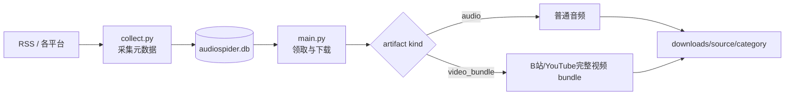

# AudioSpider：统一的音频与视频数据采集流水线

AudioSpider 是一个使用 Python 编写的命令行工具。正式路径用同一套
`collect.py -> audiospider.db -> main.py` 编排普通音频、B站完整分P视频和
YouTube 完整母视频，再按 artifact 类型生成不同文件闭包。

如果你第一次接触 Python、Conda、SQLite 或爬虫，不用先读源码。按照本页的“十分钟上手”操作即可。

> 使用前请确认你有权访问、下载和使用目标内容。代码采用 MIT License，并不代表爬取到的音频自动获得训练或商业使用授权。

## 1. 先理解唯一主路径

AudioSpider 把正式工作拆成三个独立步骤，所有来源共享同一个数据库交接：



### 发现：`discover.py`

从 Apple Podcasts 或 Podcast Index 搜索播客，得到 RSS 地址，再把 RSS 中的节目写入数据库。它适合扩充新的播客来源。

### 收集：`collect.py`

负责有界来源适配与元数据入库，不下载大媒体。当前实现包含固定 RSS、LibriVox、
小宇宙、喜马拉雅、B站和 YouTube。B站新任务默认是完整分P `video_bundle`；
YouTube 从受控 manifest 核验完整母视频后入队。同语言平台字幕优先人工轨，
再选自动轨；`require_caption=false` 时无同语言字幕也保留完整 MP4/WAV，并在
sidecar 明确标注 `missing` 或 `no_matching_language`，不生成假字幕文件。

### 下载：`main.py`

从数据库原子领取 `pending` 任务。普通音频使用 audio downloader；
`video_bundle` 使用平台 handler 构建 MP4、WAV、字幕和 `metadata.json`，只有完整
闭包通过验收才提交 `done`。

最重要的规则是：

- `discover.py` 和 `collect.py` 负责往数据库放任务。
- `main.py` 才会产生大文件和消耗大量磁盘。
- 第一次运行不要直接执行默认全量发现或持续下载。
- 先运行 `doctor.py`，再运行 `probe.py`。

大规模扩量应同时设置 feed、单 feed 单集和本轮新增三层上限。例如第一阶段目标约 5,000 条：

```bash
python discover.py --source apple_keyword \
  --keywords 中文播客 科技访谈 人文历史 有声书 \
  --top 50 --max-feeds 100 --episodes-per-feed 50 --max-new-records 5000
python metadata_backfill.py --audit-only --limit 10000
python main.py --limit 5000 --workers 4 --format original --background all
```

每批结束后先审计覆盖率和失败原因，再增加下一批，避免来源临时异常时持续放大错误。
可用 `--exclude-feed-host anchor.fm spreaker.com` 临时跳过已证实不可达的主机；feed 仍保留在数据库，以后可以单独重试。

### B站和 YouTube 视频

- B站新采集默认生成完整分 P `video_bundle`；数据库里的历史 B站 audio 记录保持兼容。
- YouTube 只保存完整母视频，不默认生成 clip。
- 两者都由 `collect.py` 入库、`main.py` 下载，输出位于
  `downloads/<source>/<category>/`。
- 视频 bundle 至少包含完整 MP4、16 kHz 单声道 WAV 和 `metadata.json`；有平台字幕
  时再保存原始/标准化字幕与 TXT。
- 字幕按 `manual/platform_manual`、`automatic/platform_auto`、
  `unknown/platform_unknown` 分类；字幕来源不能推导媒体是否 AI 生成。
- 字幕语言必须与内容语言同族；中文/粤语视频不能用英文字幕兜底。
- B站匿名响应要求登录时保存 `auth_required`，不伪装成“无字幕”。
- B站没有可用的同语言平台轨时，可显式启用**画面字幕 OCR**：它从已经下载的
  `source.mp4` 像素中识别烧录字幕，仍写回同一个 bundle 和 SQLite 闭包，不另建队列或
  `datasets/` 根目录。OCR 结果必须标成 `visual_ocr`，不能冒充平台人工/自动字幕。

正式操作示例：

```bash
# B站：按 config.py 的有界搜索配置采集完整分P任务，再下载一条
python collect.py --spiders bilibili
python main.py --source bilibili --artifact-kind video_bundle --limit 1 --workers 1 --format original

# 可选：先预览一条已完成 B站 bundle 的平台字幕/OCR 回填，再显式写入
bash scripts/bootstrap_ocr_conda.sh
/root/miniforge3/envs/audiospider-ocr/bin/python scripts/backfill_bilibili_captions.py --job-key '<完整 job_key>' --limit 1 --visual-ocr
/root/miniforge3/envs/audiospider-ocr/bin/python scripts/backfill_bilibili_captions.py --job-key '<完整 job_key>' --limit 1 --visual-ocr --apply

# YouTube：默认读取 config/youtube_sources.initial.json；先限制一条
AUDIOSPIDER_YOUTUBE_MAX_ITEMS=1 python collect.py --spiders youtube
python main.py --source youtube --artifact-kind video_bundle --limit 1 --workers 1 --format original
```

`--format` 只控制普通音频；视频包始终保存 MP4 和 WAV。`bilibili_dataset.py`、
`youtube_dataset.py` 保留为兼容、修复和审计工具，不是新手正式下载入口。完整流程见
[统一下载指南](docs/DOWNLOAD-GUIDE.md)和[统一媒体架构](docs/architecture.md)。

上述回填命令的参数以当前部署的
`python scripts/backfill_bilibili_captions.py --help` 为准。视觉 OCR 不需要 Cookie；只有
重查受登录保护的平台字幕清单时，才在用户明确授权后使用
`--allow-bilibili-cookie`。即使使用用户当前 Edge 的 B站登录态，也只能最小化提取、经
stdin/一次性内存桥注入并只发往 `api.bilibili.com`，不得复制浏览器 profile 或把 Cookie
写进命令行、聊天、日志、SQLite、sidecar、下载目录或 Git。

旧 standalone bundle 可先运行 `python scripts/migrate_video_bundles.py` 做默认 dry-run；
确认报告后再显式加 `--apply`。apply 会先备份 SQLite，再移动、复验和登记 bundle。

## 2. 十分钟上手

### 第一步：进入仓库

服务器上的仓库路径是：

```bash
cd /root/code/github_repos/AudioSpider-fork
```

### 第二步：激活 Conda 环境

这台服务器已经创建了 `audiospider` 环境：

```bash
source /root/miniforge3/etc/profile.d/conda.sh
conda activate audiospider
python --version
```

应看到 Python 3.11.x。

如果是在一台新机器上，可以运行：

```bash
bash scripts/bootstrap_conda.sh
source "$(conda info --base)/etc/profile.d/conda.sh"
conda activate audiospider
```

环境定义在 `environment.yml`，精确 Python 包版本记录在 `requirements-lock.txt`。

### 第三步：检查环境

```bash
python doctor.py
```

正常情况下会显示：

```text
[通过] python
[通过] packages
[通过] ffmpeg
[通过] directories
[通过] disk
[通过] database
```

JSON 输出：

```bash
python doctor.py --json
```

### 第四步：运行本地测试

```bash
bash scripts/test.sh
```

或者：

```bash
make test
```

测试使用本机临时 HTTP 服务，不会访问真实网站，也不会污染正式数据库。

### 第五步：小规模测试真实爬取

先测试一个固定 RSS，只读取一个 feed 的前五集：

```bash
python probe.py --source podcast_rss --feeds 1 --episodes 5
```

`probe.py` 默认使用 `/tmp` 临时数据库，不会改动正式 `audiospider.db`，也不会下载音频。

其他来源：

```bash
python probe.py --source librivox --books 1 --episodes 5
python probe.py --source xiaoyuzhou --feeds 1 --episodes 5
python probe.py --source ximalaya --seeds 2 --probes 6
python probe.py --source bilibili --search-pages 1 --videos 2 --parts 3
```

看到 `"result": "ok"` 且 `database_records` 大于 0，说明真实页面/API 解析成功。

### 第六步：查看正式数据库

```bash
python main.py stats
python discover.py --stats
python db_viewer.py overview
```

### 第七步：第一次正式采集

推荐先运行标准 RSS：

```bash
python collect.py --spiders podcast_rss
```

它会把发现的节目写入数据库，但不会下载音频。

### 第八步：只下载一条

```bash
python main.py \
  --source podcast_rss \
  --limit 1 \
  --workers 1 \
  --format original
```

下载后检查：

```bash
python main.py stats
find downloads -type f | head
```

确认无误后再逐步提高 `--limit` 和 `--workers`。

## 3. 安全的常用命令

### 只使用 Apple 发现少量播客

```bash
python discover.py \
  --source apple_keyword \
  --keywords 中文播客 \
  --top 10
```

### 从固定 RSS 更新节目

```bash
python collect.py --spiders podcast_rss
```

### 下载中文 RSS 节目

```bash
python main.py \
  --source podcast_rss \
  --language zh \
  --limit 20 \
  --workers 2 \
  --format original
```

### 转成 Opus

```bash
python main.py --limit 20 --workers 2 --format opus
```

代码会把输入 PCM 以 24 kHz、单声道、32 kbps 编码并交给 libopus。标准 Opus 解码器通常报告 48 kHz；训练代码如果严格需要 24 kHz，应在加载后显式重采样。

### 持续下载

```bash
python main.py \
  --loop \
  --limit 100 \
  --workers 4 \
  --interval 60
```

也可以使用包装脚本：

```bash
bash download_zh_podcast.sh
```

不要把 `--interval` 设置成 0。

### 重试失败任务

```bash
python main.py --retry-failed --limit 100
python main.py --retry-failed --source bilibili --limit 100
```

## 4. 数据保存在哪里

如果你只想查看已经下载的文件、理解数据库数量与物理文件数量的区别，先看[查看已下载音频和详细背景信息](docs/getting-started/using-downloaded-data.md)。

运行后会生成：

```text
AudioSpider-fork/
├── audiospider.db         SQLite 数据库
├── downloads/             所有正式音频和完整视频 artifact
├── logs/                  运行日志
└── tmp/                   SQLite/程序临时文件
```

下载目录通常如下：

```text
downloads/
├── podcast_rss/
│   └── 教育/
│       ├── episode_xxx.mp3
│       └── episode_xxx.json
├── bilibili/               # 默认完整分P video_bundle
│   └── 访谈/<source-id>/<job-key>/
│       ├── source.mp4
│       ├── audio.wav
│       ├── captions.*.json/.vtt/.txt  # 平台字幕；条件存在
│       ├── captions.*.rejected.json   # 错配轨道隔离证据；条件存在
│       ├── visual_ocr.json/.vtt/.txt  # 视觉 OCR；无稳定 cue 时仅 JSON
│       └── metadata.json
├── youtube/                # 完整母视频，不默认 clip
│   └── 访谈/<source-id>/<job-key>/
│       ├── source.mp4
│       ├── audio.wav
│       └── metadata.json
├── xiaoyuzhou/
│   └── 播客/
└── ximalaya/
```

JSON 元信息包含：

- 标题、来源、来源 ID
- 原始 URL
- 格式、大小、时长
- 语言、分类、说话人/节目名
- 发布时间、采集时间
- 最终文件 SHA-256
- 简介、作者、原网页和封面
- 来源特有的版本化背景信息
- 已保存 transcript、章节和公版原文的路径与哈希

本项目在 `dev_L4_1gpus` 上已经完成一次 5,000 条数据的实测扩量：5,000 条记录全部有版本化元数据，4,775 条音频完成下载，4,713 个物理音频通过全量 ffprobe，62 条因内容哈希重复而只保留一份文件。完整数字、失败来源和验收命令见[2026-09-09 终态验收报告](docs/reports/2026-09-09-complete-metadata-and-scale-validation.md)。

来源实际提供时还会出现 `.description.txt`、`.cover.jpg`、`.transcript.*`、`.chapters.*` 和 `.source-text.*`。平台原文和未来 ASR 必须通过 `text_source` 区分。

## 5. 下载任务状态

`audio_urls.status` 常见值：

| 状态 | 含义 |
|---|---|
| `pending` | 已发现，等待下载 |
| `downloading` | 已被某个 worker 领取，lease 尚未过期 |
| `done` | 下载完成或被判定为重复内容 |
| `failed` | 下载、校验或转码失败 |

下载任务通过 SQLite 事务原子领取。进程异常退出后，不会立刻把所有活跃任务重置；只有 lease 过期的任务才会重新变为 `pending`。
下载器会周期性续租整批尚未完成的任务；新进程回收过期任务时也严格沿用自己的来源、类别、语言、时间和产物类型范围，避免并行的 B 站与 YouTube 批次互相改写状态。
若进程已确认退出但不能等待 lease 到期，使用默认 dry-run 的
`scripts/recover_download_claims.py`，按完整 `claimed_by + source + artifact_kind` 和批次过滤器
预览；审阅后再 `--apply`。不要手写全局状态 UPDATE。

## 6. 默认安全限制

| 项目 | 默认值 |
|---|---:|
| 下载并发 | 4 |
| CLI 最大 workers | 32 |
| 单批最大任务数 | 10,000 |
| 单文件最大大小 | 4 GiB |
| 磁盘最小保留空间 | 20 GiB |
| 下载 lease | 7,200 秒 |
| RSS 最大响应 | 20 MiB |
| 单个背景资产 | 20 MiB |
| 每条音频背景资产总量 | 50 MiB |
| 每条音频背景资产数量 | 12 |
| B站每关键词搜索页 | 5 |
| B站每关键词视频数 | 100 |
| B站每视频分P数 | 200 |

下载器还会：

- 拒绝非 HTTP(S) URL。
- 拒绝 localhost、私网、link-local 和保留地址。
- 对每次重定向重新校验目标。
- 使用 `.part` 文件和 Range 断点续传。
- 校验 Content-Range、响应、响应大小和磁盘水位。
- 用 ffprobe 确认最终文件确实包含音频流。
- 对最终文件计算 SHA-256。

## 7. 各来源当前特点

| 来源 | 适合用途 | 当前限制 |
|---|---|---|
| Apple Podcasts | 大范围发现 RSS | 目录地区不等于实际语言 |
| Podcast Index | 扩充大量 RSS | 需要 API Key/Secret |
| 固定 RSS | 最稳定的日常增量来源 | 只支持 RSS 2.0，不支持全部 Atom 扩展 |
| LibriVox | 公版有声书 | Archive.org 在部分服务器可能不可达 |
| 小宇宙 | 中文播客 | 页面结构变化可能导致标题退化 |
| 喜马拉雅 | 种子附近音频探索 | 不是正式专辑分页，语言/分类是启发式 |
| B站 | 完整分P视频 bundle + 训练 WAV + 同语言平台字幕 | 匿名/登录态差异、风控、版权和大文件风险 |
| YouTube | 完整母视频 bundle + 训练 WAV + 同语言平台字幕 | 网络可达性、字幕缺失、版权和大文件风险 |

外部站点随时可能修改页面、字段、签名或访问规则。探针失败不一定是代码崩溃，也可能是网络、地区、风控或服务条款限制。

视觉 OCR 的真实边界：它只能读到视频帧里实际可见的字，不能恢复关闭的 CC；小字、模糊、
动画、遮挡、竖排、花字和场景文字都可能漏检或误报。平台 `manual` 只是平台轨证据，平台
`automatic` 是平台自动轨；`visual_ocr` 则是本地自动提取，字幕原本由谁制作通常未知。
OCR 文档固定标为 `human_review_status=unreviewed`；跨帧一致性、置信度和静态覆盖层过滤只是
技术筛选，不等于人工验真。正式数据仍须按时间轴、误报率和人工抽检质量门验收。

## 8. 配置

主要配置在 `config.py`。敏感凭据应通过环境变量设置，不要写进代码：

```bash
export PODCAST_INDEX_KEY="你的 key"
export PODCAST_INDEX_SECRET="你的 secret"
```

安全资源上限可以参考 `.env.example`：

```bash
export AUDIOSPIDER_MAX_WORKERS=8
export AUDIOSPIDER_MAX_BATCH_SIZE=1000
export AUDIOSPIDER_MAX_DOWNLOAD_BYTES=2147483648
```

项目不会自动加载 `.env` 文件；请在 shell、systemd 或任务平台中注入环境变量。

## 9. 常见问题

### `python` 命令不存在

先激活 Conda：

```bash
source /root/miniforge3/etc/profile.d/conda.sh
conda activate audiospider
```

### `ModuleNotFoundError`

```bash
python -m pip install -r requirements-lock.txt
python -m pip check
```

### `ffmpeg` 不存在

Ubuntu/Debian：

```bash
sudo apt update
sudo apt install -y ffmpeg
```

### Archive.org 超时

先检查：

```bash
curl -I --max-time 15 https://archive.org/
```

如果 TCP 连接超时，需要处理服务器出口网络、代理或地区访问问题；反复重跑 LibriVox 不会解决。

### 为什么有 `dup:<hash>`

表示该任务下载到的最终内容与已经保存的文件 SHA-256 相同。数据库保留来源记录，但不会重复保存物理文件。

### 为什么 `--format opus` 最后不是 24 kHz

Opus 标准解码通常工作在 48 kHz。代码的 `-ar 24000` 表示编码器输入采样率，不保证播放器或训练库报告 24 kHz。

### 已经下载的音频怎么补背景信息

先重新运行对应来源的受控采集，然后：

```bash
python main.py background --limit 10000 --workers 4 --background all
```

如果数据库里已经有旧记录，先按稳定来源 ID 回填详细信息；这比重新搜索更能覆盖历史 B站分P和喜马拉雅 track：

```bash
python metadata_backfill.py --audit-only --limit 10000
python metadata_backfill.py --limit 10000 --report logs/metadata-backfill.json
python main.py background --limit 10000 --workers 4 --background all
```

报告把记录分为 `rich`（常用字段充分）、`partial`（来源只公开了部分字段）和 `unresolved`（本轮无法从来源解析），不会把空 JSON 当成“详细信息齐全”。

更多问题见[故障排查指南](docs/guides/troubleshooting.md)。

## 10. 文档导航

### 新手

- [文档总目录](docs/README.md)
- [核心概念](docs/getting-started/concepts.md)
- [从零安装](docs/getting-started/installation.md)
- [第一次运行](docs/getting-started/first-run.md)

### 日常使用

- [发现与采集](docs/guides/discovery-and-collection.md)
- [下载与转码](docs/guides/download-and-convert.md)
- [运行与维护](docs/guides/operations.md)
- [故障排查](docs/guides/troubleshooting.md)

### 技术参考

- [CLI 命令参考](docs/reference/cli.md)
- [统一采集与下载指南](docs/DOWNLOAD-GUIDE.md)
- [统一 Sidecar Schema](docs/SIDECAR-SCHEMA.md)
- [配置与环境变量](docs/reference/configuration.md)
- [数据库结构](docs/reference/database.md)
- [来源适配器](docs/reference/spiders.md)
- [背景信息与文本资产](docs/reference/background-metadata.md)
- [背景信息深度研究](docs/research/2026-09-09-background-metadata-research.md)
- [YouTube 视频与字幕数据集](docs/guides/youtube-datasets.md)
- [B 站视频、WAV 与平台字幕](docs/guides/bilibili-video-datasets.md)
- [B 站视频 sidecar](docs/reference/bilibili-video-sidecars.md)

### 设计与开发

- [统一媒体架构](docs/architecture.md)
- [系统设计细节](docs/design/architecture.md)
- [安全边界](docs/design/security.md)
- [数据流与状态机](docs/design/data-flow.md)
- [开发与测试](docs/design/development.md)
- [ADR-001：背景信息混合存储](docs/design/adr-001-background-metadata.md)
- [ADR-002：统一媒体 Artifact](docs/design/adr-002-unified-media-artifacts.md)
- [统一媒体流水线设计](docs/plans/2026-09-10-unified-media-pipeline-design.md)
- [统一媒体流水线实施计划](docs/plans/2026-09-10-unified-media-pipeline.md)
- [B 站错配字幕时间轴设计](docs/plans/2026-09-10-bilibili-invalid-caption-timeline-design.md)
- [B 站错配字幕时间轴实施计划](docs/plans/2026-09-10-bilibili-invalid-caption-timeline.md)
- [安全问题报告](SECURITY.md)
- [变更记录](CHANGELOG.md)
- [dev_L4_1gpus 服务器验收报告](docs/reports/2026-09-08-dev-l4-validation.md)

## 11. 运行状态与版本管理

查看当前版本：

```bash
git log -1 --oneline
git status --short --branch
```

升级代码前请先停止下载进程、备份 `audiospider.db`，升级后运行：

```bash
bash scripts/bootstrap_conda.sh
python doctor.py
bash scripts/test.sh
```

完整升级流程见[运行与维护](docs/guides/operations.md)。

## 12. License

项目代码使用 [MIT License](LICENSE)。目标音频的版权、隐私、平台条款和训练授权由使用者自行确认。
