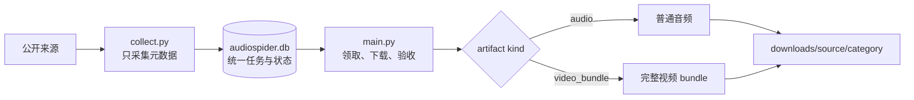
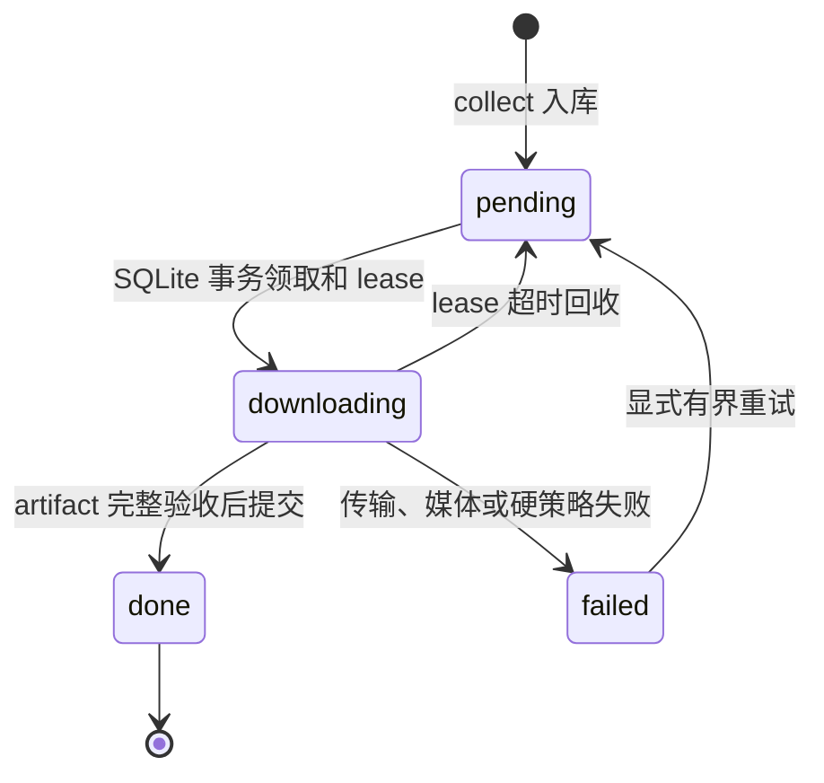

# AudioSpider 统一媒体架构

> 实施状态：统一队列已实现。普通音频、B站完整分P和 YouTube 完整母视频都由
> SQLite 交接给 `main.py`；standalone 工具只保留兼容、修复和审计能力。

## 唯一正式主路径



`discover.py` 可以发现播客 feed，但产生的正式节目任务仍写入同一个数据库。
正式下载只由 `main.py` 发起。

## 为什么编排统一、产物不统一

普通播客是一份音频文件；B站和 YouTube 需要一个目录闭包。统一的是：

- collect 与 download 分离；
- SQLite 任务、状态、lease、重试和统计；
- 安全网络访问、磁盘水位和字节上限；
- sidecar envelope、rights、AI 与字幕 provenance；
- SHA-256 和完成验收。

不能强行统一的是：

- B站的 BV、CID、DASH 与登录门禁；
- YouTube 的 video ID、yt-dlp 格式与人工/自动字幕字典；
- RSS 音频的 enclosure、章节、transcript 和公版原文；
- 文件闭包：音频是一个主文件，视频是多文件 bundle。

## 来源默认行为

| 来源 | 默认产物 | 说明 |
|---|---|---|
| RSS/小宇宙/喜马拉雅/LibriVox | `audio` | 当前行为保持不变 |
| B站 | `video_bundle` | 完整分P；历史 audio 记录保持兼容 |
| YouTube | `video_bundle` | 受控 manifest 中的完整母视频 |

B站新采集不再产生纯音频任务；数据库里的历史 B站 `audio` 记录仍可由普通音频
handler 完成。YouTube clip 不在默认主路径；只有用户明确要求时才可作为父 bundle
的派生产物。

## 状态机



视频任务在 staging 中可能已经有部分流或字幕，但数据库只有在整个 bundle 通过
audit 后才进入 `done`。字幕 `auth_required` 不是队列状态，而是 sidecar 内的来源
事实。

## 目录结构

```text
downloads/
├── podcast_rss/<category>/<audio> + <sidecar>
├── xiaoyuzhou/<category>/<audio> + <sidecar>
├── ximalaya/<category>/<audio> + <sidecar>
├── librivox/<category>/<audio> + <sidecar>
├── bilibili/<category>/<source-id>/<job-key>/
│   ├── source.mp4
│   ├── audio.wav
│   ├── captions.*.json/.vtt/.txt
│   └── metadata.json
└── youtube/<category>/<source-id>/<job-key>/
    ├── source.mp4
    ├── audio.wav
    ├── captions.*.vtt/.txt
    └── metadata.json
```

## 字幕与媒体 AI 是两条轴

| 字段 | 允许值 | 回答的问题 |
|---|---|---|
| `content_language` | BCP-47/项目规范，未知 `und` | 媒体主要说什么语言 |
| `caption.language` | 平台轨语言 | 字幕是什么语言 |
| `caption.kind` | `manual/automatic/unknown` | 平台字幕生成来源 |
| `caption.text_source` | `platform_manual/platform_auto/platform_unknown` | 文本来源证据 |
| `ai_generation.status` | `declared/not_declared/suspected/unknown` | 媒体本身是否 AI 生成 |
| `rights.status` | 默认 `needs_review` | 是否具备使用权证据 |

自动字幕不证明视频或音频由 AI 生成。平台 manual 也不等于逐字人工验真。字幕必须
与内容语言同族；中文/普通话/粤语内容不能用英文字幕兜底。

## 当前正式命令

当前可运行：

```bash
python collect.py --spiders podcast_rss
python main.py --source podcast_rss --limit 1 --workers 1 --format original
python collect.py --spiders bilibili
python main.py --source bilibili --limit 1 --workers 1 --format original
AUDIOSPIDER_YOUTUBE_MAX_ITEMS=1 python collect.py --spiders youtube
python main.py --source youtube --limit 1 --workers 1 --format original
python main.py stats
```

`main.py --source` 同时过滤普通音频和视频 bundle。`--format` 只控制普通音频；视频
handler 始终生成完整 MP4 与 WAV。YouTube 默认读取 `config/youtube_sources.initial.json`，
可用 `AUDIOSPIDER_YOUTUBE_MANIFEST` 指定另一个受控 manifest。

旧 standalone bundle 使用迁移脚本。默认仅 dry-run：

```bash
python scripts/migrate_video_bundles.py
python scripts/migrate_video_bundles.py --legacy-root /path/to/legacy-root
```

确认报告无失败后才执行：

```bash
python scripts/migrate_video_bundles.py --apply
```

`--apply` 先用 SQLite backup API 备份数据库，再把已验收 bundle 移到
`downloads/<source>/<category>/<source_id>/<job_key>/` 并登记为 done。可用 `--db` 和
`--report` 指定数据库及 JSON 报告。

迁移步骤与测试门见[实施计划](plans/2026-09-10-unified-media-pipeline.md)。完整设计与
失败模式见[设计文档](plans/2026-09-10-unified-media-pipeline-design.md)，决策理由见
[ADR-002](design/adr-002-unified-media-artifacts.md)。

## 验收

当前文档和代码基线：

```bash
bash scripts/test.sh
python scripts/check_docs.py
python doctor.py
python main.py stats
git diff --check
```

统一实现的真实验收必须顺序执行一条普通音频、一个 B站分 P 和一个 YouTube
母视频，并核对数据库状态、ffprobe、字幕语言/provenance、SHA-256、sidecar、磁盘
字节与 staging 清空。不得用合成 fixture 宣称真实平台字幕覆盖。
