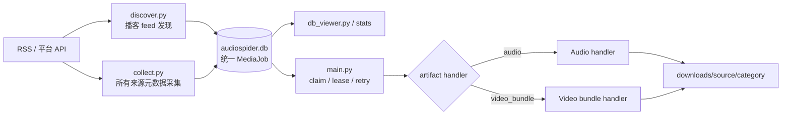

# 系统架构

## 目标与边界

AudioSpider 是单机优先的统一媒体采集流水线。当前架构把普通音频、B站完整分 P
和 YouTube 完整母视频都交给 SQLite 任务队列；不同 artifact 保留不同文件闭包。
它不是分布式调度平台、通用浏览器爬虫或数据授权系统。

> 实施状态：普通音频和视频 bundle 都已走统一队列。standalone
> dataset CLI 只作为迁移、修复和底层验证工具。

## 组件图

## 入口层

- `discover.py`：Apple/Podcast Index 目录发现与 RSS 解析。
- `collect.py`：编排全部正式来源，只写任务和元数据。
- `main.py`：统一统计、领取、重试并按 artifact kind 路由下载 handler。
- `probe.py`：对单个 Spider 做有界真实测试。
- `doctor.py`：本机环境与数据库诊断。
- `db_viewer.py`：人类可读的数据库浏览。
- `youtube_dataset.py`：兼容/修复工具；其完整母视频、同语言字幕和 audit 能力由
  `media_artifacts.py` 复用，clip 仅作显式授权的历史兼容能力。
- `youtube_vtt.py`：WebVTT 解析、自动滚动字幕消重和确定性 cue 分组。
- `bilibili_dataset.py`：兼容/修复工具；其 DASH、字幕和 bundle audit 能力由
  `media_artifacts.py` 复用。
- `bilibili_subtitles.py`：B 站字幕三态来源判定和原始 JSON→VTT/TXT 转换。
- `media_artifacts.py`：`Downloader` 领取 `video_bundle` 后的固定来源 dispatcher；
  输出到 source/category/source_id/job_key 并回传 bundle fingerprint。

入口脚本负责参数校验和编排，不应复制存储或下载核心逻辑。

## 来源层

`spiders/base.py` 定义公共 Spider 行为。来源模块统一转换为兼容普通音频的
`AudioRecord`，用 `artifact_kind=audio/video_bundle` 区分产物。批次
回调允许结果边产生边入库，避免大列表长期占内存，也减少中途失败时的数据损失。

站点适配代码属于高变化区域。稳定边界是带 `artifact_kind` 的版本化队列记录与
`crawl(on_batch=...)`，而不是外部 HTML、匿名 API 或签名媒体 URL。

## 存储层

`storage.py` 负责：

- 建表和加法式迁移。
- URL、来源 ID 和内容哈希去重。
- 分组和日期过滤。
- 事务内原子领取。
- lease 过期回收。
- 下载完成、失败和元数据更新。

SQLite 使用 WAL。当前设计适合一台机器上的少量采集/下载进程；若写入竞争、任务规模或跨机调度成为瓶颈，应先形成迁移设计，不要仅通过启动更多进程扩容。

## 下载层

下载层把队列与产物分开：`main.py`/`Downloader` 负责统一领取、lease、统计和失败
提交；`media_artifacts.py` 对 `video_bundle` 做固定来源分派。

普通音频 handler 负责：

1. 校验目标 URL 与重定向。
2. 生成安全文件名与安全路径。
3. 检查磁盘和预计文件大小。
4. 使用 `.part` 与 Range 续传。
5. 校验响应、长度和媒体。
6. 可选调用 ffmpeg 转 Opus。
7. 计算最终 SHA-256。
8. 原子落盘、写 JSON，并提交数据库状态。

视频 bundle handler 负责 DASH/yt-dlp 表示层、完整 MP4、16 kHz WAV、字幕闭包、
SHA-256 和原子目录提升。`main.py` 控制任务批次、过滤、并发和循环；handler 不负责
发现新任务。

## 工具层

- `convert_audio.py`：离线批量 Opus 转码。
- `opus_to_wav.py`：为下游处理导出 WAV。
- `network_safety.py`：集中实现目标地址和解析结果的网络安全校验。
- `anti_crawler.py`：User-Agent、请求头、延时与代理辅助。
- `scripts/check_docs.py`：保证文档相对链接可达。
- `scripts/test.sh`：统一验证入口。
- `background.py`：背景信息规范化、URL 脱敏和受限辅助资产保存。
- `rss_metadata.py`：RSS/iTunes/Media RSS/Podcasting 2.0 字段提取。

背景信息的存储决策见 [ADR-001](adr-001-background-metadata.md)，来源能力证据见[深度研究报告](../research/2026-09-09-background-metadata-research.md)。

## 视频 bundle 层

现在 B站和 YouTube 都进入同一个 SQLite 队列，但分别保留平台 adapter。B站新采集
默认完整分P `video_bundle`；YouTube 只保存完整母视频。`job_key` 绑定稳定平台身份、
字幕语言策略、画质和 source revision。历史 clip 仅作显式兼容，不在正式任务图中。

下载先进入 `downloads/<source>/<category>/.staging/<job_key>` 并支持身份绑定的
`.part` 续传，完整闭包验证后目录级提升。未完成 staging 本身就是非零失败。内容
语言与字幕语言必须同族，中文/粤语统一按中文文本族处理。

完整架构、目录树、状态图和迁移边界见[统一媒体架构](../architecture.md)；决策见
[ADR-002](adr-002-unified-media-artifacts.md)。

## 设计原则

- 小批量优先：探针和示例必须有明确上限。
- 数据库先行：状态更新与文件落盘必须可追踪。
- 失败可恢复：续传、lease、failed 重试和 checkpoint。
- 默认安全：限制大小、并发、磁盘水位和网络目标。
- 外部事实可变：Spider 失败必须保留证据，不把当前站点行为当永久契约。
- 文档与代码同步：新增参数、字段或来源时同步更新对应层级文档。

## 何时需要重新设计

出现以下任一情况时，不应继续在现有单机模型上堆补丁：

- 多台服务器必须共享任务。
- SQLite 写锁持续成为吞吐瓶颈。
- 需要严格的租户、权限或审计隔离。
- 需要数百万级活跃任务的调度与优先级。
- 需要对象存储事务、生命周期和跨区域复制。
- 需要浏览器登录态或集中式凭据服务。

此时应评估队列、服务型数据库、对象存储和独立 worker，但迁移仍需保持当前状态机和幂等语义。
