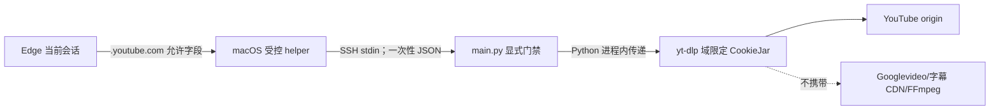

# 安全边界

## 威胁模型

AudioSpider 会处理不可信的远程 URL、HTTP 头、XML/HTML/JSON、标题和文件名。主要风险是 SSRF、重定向到内网、超大响应耗尽磁盘、路径穿越、错误页伪装成音频、解码器处理恶意媒体、并发状态竞争和凭据泄露。

## 网络目标校验

`network_safety.py` 与下载器共同限制目标：

- 只允许 HTTP 和 HTTPS。
- 拒绝缺少主机名、内嵌用户名密码和非法端口。
- 拒绝 localhost、私网、link-local、loopback、multicast、unspecified 和保留地址。
- 检查 DNS 解析出的所有地址。
- 不自动信任重定向；每一跳重新验证。

这降低 SSRF 风险，但 DNS、代理和基础设施配置仍属于部署边界。生产环境应在网络层同时限制元数据服务、内网网段和不需要的出口。

## 响应与文件保护

- RSS 和单个媒体都有最大字节数。
- 封面、字幕、章节和原文使用与音频相同的公网 DNS 与逐跳重定向校验，并另设数量、单文件和单条记录总字节上限。
- 外部 HTML 在落盘前移除脚本、表单、内联事件、样式和危险 URL 协议；它只是离线参考资料，不应直接作为可信网页发布。
- 下载前和下载中检查磁盘安全水位。
- Range 续传校验 `Content-Range`，不把任意 416 当作完成。
- 拒绝明显的 HTML/JSON 错误响应。
- 完成前用 ffprobe 确认存在音频流。
- 文件名清理控制字符、路径分隔符和保留字符。
- 最终路径必须保持在配置的下载根目录内。

内容媒体仍会交给 ffmpeg/ffprobe 解析。应及时更新系统媒体工具，并把采集进程运行在低权限账户或隔离容器中。

## 资源保护

环境变量设置批大小、worker、文件大小、磁盘保留和 lease 上限。CLI 对正整数和最大值做校验。不要为追求吞吐关闭这些限制；先用真实样本测量 CPU、内存、网络和磁盘。

## 数据与隐私

- URL 和 sidecar 可能包含查询参数、资源标识或签名。
- 标题、主播和节目元数据可能包含个人信息。
- 日志和探针样例应避免打印完整签名 URL；探针只输出媒体主机。
- 音频和辅助资源的 sidecar URL 会移除查询串；持久化的下载错误也会对其中的 URL 查询串脱敏。
- 不要把 `audiospider.db`、`downloads/`、日志或真实凭据提交到 Git。
- 数据保留、删除、训练和再分发应符合来源授权、平台条款和适用法律。

## 凭据

Podcast Index Key/Secret 仅从环境变量读取。部署时使用任务平台、systemd
凭据或秘密管理器；避免把值写进 shell 历史。

### YouTube 一次性 Cookie 门禁

YouTube 始终从匿名路径开始。只有用户已针对当前任务明确授权，且匿名路径命中平台
bot challenge 时，才可以使用 `main.py --allow-youtube-cookie`。门禁还要求
`download + source=youtube + artifact_kind=video_bundle`、显式 batch/category/language、
`workers=1`且不使用分组领取，并禁止循环任务；不加门禁时，
即使环境里残留同名数据也不会使用。

实现约束：

- helper 从 Edge Local State 解析当前 `last_used` profile，或只接受显式
  `Default`/`Profile N`；只读对应 Cookie SQLite，用系统 Keychain 在内存解密，
  不复制整个 profile，也不静默改用另一个 profile。
- 只允许 `.youtube.com`/`youtube.com`/`www.youtube.com` 和固定 Cookie 名单；不接受
  `.google.com`、`.googlevideo.com` 或伪装后缀。
- payload 有总字节、条目数、单值长度、有效期、路径、secure 和控制字符上限；必须具备
  能表示已登录 YouTube 的最小必要字段。
- 只通过 stdin 进入，只存在于 helper、`main.py` 和单个可终止 worker 的内存中。
- 禁止 cookie file、`--cookies-from-browser`、argv、环境变量、临时 profile 和全局
  `Cookie` header；错误、IPC 和 `failure.json` 必须脱敏。
- Cookie 只由 CookieJar 按域/路径/secure 规则发送到 YouTube origin，不传给
  Googlevideo、字幕 CDN、代理、FFmpeg、B站或其他任务。
- 事后泄漏审计对大候选文件分块扫描，包含常见可逆编码形态和所有 SQLite
  表；候选文件读取失败必须返回 `error`，不得仍报 `clean`。

本地网络助手是受限 loopback 边界，不是对外服务。YouTube CONNECT 白名单代理使用
两端同号 `127.0.0.1:18797`，PO Token provider 使用两端同号
`127.0.0.1:4416`，并使用 `mweb` client、`bgutil-ytdlp-pot-provider==2.0.0`、
Deno 2.9.0 和 EJS 0.8.0。启动后必须同时证明 YouTube/Googlevideo 允许域可用、
无关 HTTPS 域名被 403 拒绝。npm 依赖 `qs` 的已知中危属于该本机 loopback
provider 的依赖风险；回环绑定和域名白名单降低暴露面，但不代表风险为零，应在上游
兼容时升级并重做金丝雀。

`.env.example` 只列变量名和非秘密默认值。项目不会自动加载 `.env`。

## 数据库并发

SQLite 原子领取防止多个 worker 获得同一任务。lease 防止进程崩溃后永久卡死，也避免活跃任务被立即抢占。手工修改状态会绕过这些不变量，应在备份后、停止相关进程时进行。

## 不在当前边界内

- 绕过付费墙、验证码、DRM、会员或未获授权的平台访问控制。一次性门禁只使用
  用户已有、已明确授权的普通 YouTube 会话，不用于扩大账号权限。
- 证明某份音频拥有训练或商业使用授权。
- 在不可信多租户环境中提供隔离。
- 对外暴露 Web API 或管理端。
- 对下载内容做恶意软件和版权自动判定。

## 漏洞报告

不要在公开 issue 中粘贴 Secret、Cookie、签名 URL、私人音频或完整数据库。报告时提供最小复现、受影响版本、预期与实际行为和已脱敏日志。处理流程见根目录 [SECURITY.md](../../SECURITY.md)。
