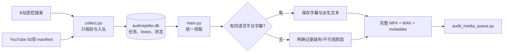

# 150 个中英文完整访谈批次运行手册

本手册对应一个有边界、可续跑、可审计的生产批次：

| 来源 | 目标 | 媒体 | 语言 | 字幕策略 | 正式目录 |
|---|---:|---|---|---|---|
| B站 | 新增 100 条 | 每个 BV 的完整 P1 | 中文 | 尽量取中文同族字幕；没有也保留 | `downloads/bilibili/访谈/` |
| YouTube | 50 条 | 完整母视频，不切 clip | 英文 | 尽量取英文字幕；没有也保留 | `downloads/youtube/访谈/` |

两批必须走同一条正式链路：



`bilibili_dataset.py` 和 `youtube_dataset.py` 不能代替这个流程；它们只保留兼容、
修复和底层审计作用。

## 1. 完成定义

“完成”不是“命令退出了”，而是同时满足：

1. B站本轮真实新增 100 条 `video_bundle`，YouTube 目标 manifest 的 50 条均有可追踪结果；
2. 成功项状态为 `done`，失败项保留结构化原因，不静默丢失；
3. 每个 done bundle 都有可解码的完整 MP4、16 kHz mono PCM16 WAV 和
   `metadata.json`；
4. 有字幕时只保存同语言族平台字幕，并区分 manual/automatic/unknown；
5. 无字幕时不创建假 VTT/TXT，sidecar 明确记录 missing 或更细的不可用原因；
6. 统一审计 `failure_count=0` 且 `orphan_count=0`；
7. 最终报告单独统计本批，不拿全库历史总数冒充本批成果。

## 2. 生产前门禁

```bash
ssh dev_L4_1gpus
cd /root/code/github_repos/AudioSpider-fork
source /root/miniforge3/etc/profile.d/conda.sh
conda activate audiospider

git status --short
git rev-parse HEAD
git rev-parse origin/main
python doctor.py
python main.py stats
ps aux | grep -E 'collect.py|discover.py|main.py'
df -h .
bash scripts/test.sh
python scripts/check_docs.py
git diff --check
```

要求：已部署支持统一 B站批次边界和 YouTube `require_caption=false` 的版本；没有来源
不明的工作树改动、数据库迁移或竞争 writer；数据盘能容纳 150 个长视频、WAV 与 staging；
YouTube manifest 存在且恰好有 50 个唯一单视频条目。

另外必须单独验证 YouTube 出口；B站可访问不代表 YouTube 可访问：

```bash
timeout 20 curl -I https://www.youtube.com
```

若出现 `Network is unreachable` 或超时，先取得用户批准的合规代理/临时受限隧道再跑
YouTube。代理地址和凭据只能保存在当前进程环境，不得写入 `.env`、Git、SQLite、日志或
sidecar；网络错误也不能伪装成“平台无字幕”。

## 3. 备份 SQLite 并记录 baseline

停止 writer 后使用 SQLite backup，不要直接复制活动中的 WAL 数据库：

```bash
mkdir -p backups
sqlite3 audiospider.db \
  ".backup 'backups/audiospider-before-interviews-150-20260910.db'"

BILI_BASELINE_ID="$(sqlite3 -readonly audiospider.db \
  "SELECT COALESCE(MAX(id),0) FROM audio_urls WHERE source='bilibili';")"
YOUTUBE_BASELINE_ID="$(sqlite3 -readonly audiospider.db \
  "SELECT COALESCE(MAX(id),0) FROM audio_urls WHERE source='youtube';")"
printf 'BILI_BASELINE_ID=%s\nYOUTUBE_BASELINE_ID=%s\n' \
  "$BILI_BASELINE_ID" "$YOUTUBE_BASELINE_ID"
```

把两个数字写入运行记录。Shell 变量只在当前终端有效；断开 SSH 后不能依赖它仍存在。

## 4. 采集 B站中文访谈 100 条

本批固定参数：

- 搜索词：`人物访谈 长视频,深度访谈 完整版,人物专访 完整版,对谈 完整版,圆桌访谈,播客 访谈 视频`
- 标题至少命中：`访谈,专访,对谈,对话,圆桌,会谈,播客`
- 排除标题明确包含：`俄语,英语,英文,日语,韩语,法语,德语,西班牙语`
- 每词最多 5 页、100 个 BV；每个 BV 只取 P1；
- 本轮最多真实新增 100 条；时长 1500–14400 秒；
- `language=zh`、`category=访谈`。

```bash
AUDIOSPIDER_BILIBILI_CONTENT_LANGUAGE=zh \
AUDIOSPIDER_BILIBILI_KEYWORDS='人物访谈 长视频,深度访谈 完整版,人物专访 完整版,对谈 完整版,圆桌访谈,播客 访谈 视频' \
AUDIOSPIDER_BILIBILI_REQUIRED_TITLE_TERMS='访谈,专访,对谈,对话,圆桌,会谈,播客' \
AUDIOSPIDER_BILIBILI_EXCLUDED_TITLE_TERMS='俄语,英语,英文,日语,韩语,法语,德语,西班牙语' \
AUDIOSPIDER_BILIBILI_MAX_SEARCH_PAGES=5 \
AUDIOSPIDER_BILIBILI_MAX_VIDEOS_PER_KEYWORD=100 \
AUDIOSPIDER_BILIBILI_MAX_PAGES_PER_VIDEO=1 \
AUDIOSPIDER_BILIBILI_MAX_NEW_RECORDS=100 \
AUDIOSPIDER_BILIBILI_MIN_DURATION_SECONDS=1500 \
AUDIOSPIDER_BILIBILI_MAX_DURATION_SECONDS=14400 \
python collect.py --spiders bilibili
```

`MAX_NEW_RECORDS=100` 根据 SQLite 去重后的真实新增父 BV 数计数；已存在任何分 P 的父
BV 和本轮已接受的父 BV 都不吃配额，也不会被重复纳入本批。
采集只写元数据，不下载大媒体。

标题包含/排除词只是**候选选择证据**，不是声学语言证明。标题没写“英文”不等于音轨
一定是中文；最终仍需抽听或使用独立语言识别质检，且不能把标题规则写成
`language_verified=true`。

按 baseline 对账：

```bash
sqlite3 -readonly -header -column audiospider.db "
SELECT status,COUNT(*) AS rows
FROM audio_urls
WHERE source='bilibili'
  AND artifact_kind='video_bundle'
  AND id>$BILI_BASELINE_ID
GROUP BY status
ORDER BY status;"

sqlite3 -readonly -header -column audiospider.db "
SELECT
  COUNT(*) AS rows,
  COUNT(DISTINCT source_id) AS unique_source_ids,
  MIN(duration) AS min_seconds,
  MAX(duration) AS max_seconds,
  SUM(CASE WHEN category='访谈' AND language='zh' THEN 1 ELSE 0 END) AS policy_rows
FROM audio_urls
WHERE source='bilibili'
  AND artifact_kind='video_bundle'
  AND id>$BILI_BASELINE_ID;"
```

预期 `rows=100`、`unique_source_ids=100`、`policy_rows=100`，时长均为 1500–14400。
若不足，检查搜索耗尽、标题/时长过滤、重复项或平台临时错误；补充有界关键词后再采集，
不能复制数据库行凑数。

## 5. 采集 YouTube 英文访谈 50 条

正式 manifest：

```text
config/youtube_interviews_50_20260910.json
```

每项至少满足：

```json
{
  "url": "https://www.youtube.com/watch?v=VIDEO_ID",
  "profile": "youtube_interviews",
  "content_language": "en",
  "languages": ["en"],
  "require_caption": false,
  "speaker_count": null,
  "speaker_count_status": "needs_review",
  "rights": {"status": "needs_review"},
  "ai_generation": {"status": "unknown", "evidence": []}
}
```

```bash
AUDIOSPIDER_YOUTUBE_MANIFEST=config/youtube_interviews_50_20260910.json \
AUDIOSPIDER_YOUTUBE_MAX_ITEMS=50 \
AUDIOSPIDER_YOUTUBE_INSPECT_TIMEOUT=120 \
python collect.py --spiders youtube
```

每项必须是完整单视频、非直播/待开播、时长 1530–3636 秒。英文平台字幕存在时记录轨道；
不存在时因 `require_caption=false` 仍可入队。

```bash
sqlite3 -readonly -header -column audiospider.db "
SELECT status,COUNT(*) AS rows
FROM audio_urls
WHERE source='youtube'
  AND artifact_kind='video_bundle'
  AND id>$YOUTUBE_BASELINE_ID
GROUP BY status
ORDER BY status;"
```

如果少于 50，不要降低语言、直播或完整视频门禁；替换失败候选并重复采集，直到 50 个
唯一目标均有明确结果。重复 `job_key` 不算新样本。

## 6. B站 Cookie 只做一次性内存注入

B站字幕可能只对登录用户可见。本批虽已明确授权使用用户合法登录态，仍必须：

- 只提取当前 B站会话的最小必要 Cookie；
- 通过 SSH 标准输入或同等一次性内存通道注入；
- 远端只放进当前 `main.py` 进程环境；
- 只有显式 `--allow-bilibili-cookie` 才启用；
- Cookie 只发往 `api.bilibili.com`；
- 不输出、不落盘、不进参数、Git、日志、SQLite 或 sidecar；
- 进程结束立即清除本地/远端临时副本。

人工无回显输入示例：

```bash
read -r -s BILIBILI_COOKIE
export BILIBILI_COOKIE
python main.py --source bilibili --artifact-kind video_bundle \
  --category 访谈 --language zh --limit 1 --workers 1 \
  --format original --allow-bilibili-cookie
unset BILIBILI_COOKIE
```

不要把真实 Cookie 写进命令文本。自动化桥也只能把它作为 SSH stdin 传给远端进程，
桥接脚本和内存对象用完即清理。登录成功不保证每条视频都有字幕。

## 7. 先做两个真实冒烟

```bash
# B站：当前进程必须仍有已授权的临时 Cookie
python main.py --source bilibili --artifact-kind video_bundle \
  --category 访谈 --language zh --limit 1 --workers 1 \
  --format original --allow-bilibili-cookie

# YouTube：不使用 B站 Cookie
python main.py --source youtube --artifact-kind video_bundle \
  --category 访谈 --language en --limit 1 --workers 1 --format original

python scripts/audit_media_queue.py
```

各抽查一个 `source.mp4`、`audio.wav` 和 `metadata.json`。B站核对 BV/CID/P1，
YouTube 核对完整时长；有字幕时抽查语言/provenance，无字幕时确认没有伪造字幕文件。

## 8. 扩量下载

B站从 2 个 worker 起步，Cookie 必须仍由本轮进程内存持有：

```bash
python main.py --source bilibili --artifact-kind video_bundle \
  --category 访谈 --language zh --limit 99 --workers 2 \
  --format original --allow-bilibili-cookie

python main.py --source youtube --artifact-kind video_bundle \
  --category 访谈 --language en --limit 49 --workers 2 --format original
```

`main.py` 按 ID 从符合过滤器的 pending 队列领取。如果有更早的同分类 pending，它们可能
先被领取，所以不能只看单次 `--limit`；每轮都按 baseline 或 manifest job key 对账。
长视频会同时占网络、staging、ffmpeg、WAV 空间和磁盘 IO，不要一开始拉满并发。

## 9. 断点续跑

1. 确认旧进程确实退出；
2. 查看 `downloading` 行的 lease；
3. 不删 WAL，不强改活跃 lease；
4. lease 到期后由下一次 `main.py` 自动回收；
5. 用相同 source/category/language 重新运行有界批次；
6. B站每次续跑重新做 Cookie 内存注入。

```bash
sqlite3 -readonly -header -column audiospider.db "
SELECT source,status,COUNT(*) AS rows
FROM audio_urls
WHERE artifact_kind='video_bundle'
  AND ((source='bilibili' AND id>$BILI_BASELINE_ID)
    OR (source='youtube' AND id>$YOUTUBE_BASELINE_ID))
GROUP BY source,status
ORDER BY source,status;"

sqlite3 -readonly -header -column audiospider.db "
SELECT id,source,source_id,claimed_by,claimed_at,lease_expires_at
FROM audio_urls
WHERE artifact_kind='video_bundle' AND status='downloading'
ORDER BY id;"
```

## 10. 失败分类与有界重试

| 类别 | 处理 |
|---|---|
| 临时网络、限流、超时 | 降并发，小批重试 |
| 下架、私有、地区/年龄限制 | 保留原因，替换候选，不绕过控制 |
| B站登录态过期 | 重新取得合法会话，再内存注入 |
| 字幕缺失 | best effort，不应单独导致媒体失败 |
| 字幕请求失败 | 不能伪装成平台明确 missing |
| 时长、语言、直播策略不符 | 采集拒绝，替换候选 |
| MP4/WAV/哈希验收失败 | 保留 staging，查 ffmpeg、磁盘和源变化 |
| 权利不清 | 保持 `needs_review` |

```bash
python main.py --retry-failed --source bilibili \
  --artifact-kind video_bundle --limit 5 --workers 1 \
  --format original --allow-bilibili-cookie

python main.py --retry-failed --source youtube \
  --artifact-kind video_bundle --limit 5 --workers 1 --format original
```

`--retry-failed` 当前只按 source/artifact 过滤，可能领取历史失败行。运行前用只读 SQL
检查全部 failed；不要为“只重试本批”而手工批量改数据库状态。

## 11. 字幕与 sidecar 验收

有字幕时：

- B站可保存多条中文同族轨，每条有原始 JSON、VTT、TXT；
- YouTube 保存选择的一条英文轨和 TXT；
- `manual + platform_manual`、`automatic + platform_auto` 必须配对；
- `unknown + platform_unknown` 只用于证据不足；
- 自动翻译与生成来源分开记录；
- 不允许跨语言兜底。

无字幕时：

- YouTube：`caption.status=missing`、`require_caption=false`，没有字幕文件；
- B站：区分 `auth_required`、`not_provided_publicly`、`no_matching_language`、
  `external_failure`、`unknown`；
- 画面烧录字幕不是平台字幕文件；
- 本地 ASR 若另行运行，必须用独立 provenance，不能冒充 `platform_*`。

字幕生成来源与媒体 AI 来源是两条轴。自动字幕绝不自动推出媒体
`ai_generation.status=declared`。

## 12. 最终统一审计与计数

```bash
python scripts/audit_media_queue.py
```

期望 `failure_count=0`、`orphan_count=0`。该命令审计全库所有 done video bundle，
因此历史闭包损坏也必须先处理。

```bash
sqlite3 -readonly -header -column audiospider.db "
SELECT
  source,status,COUNT(*) AS rows,
  ROUND(SUM(file_size)/1024.0/1024/1024,2) AS primary_gib,
  ROUND(SUM(duration)/3600.0,2) AS hours
FROM audio_urls
WHERE artifact_kind='video_bundle'
  AND ((source='bilibili' AND id>$BILI_BASELINE_ID)
    OR (source='youtube' AND id>$YOUTUBE_BASELINE_ID))
GROUP BY source,status
ORDER BY source,status;"
```

`file_size` 是主产物字节，不一定等于整个 bundle；正式总字节以 sidecar `files` 闭包
或磁盘汇总为准。

最终报告至少列：代码版本、baseline、目标/入队/done/failed、总时长、bundle 总字节、
字幕 downloaded/missing、manual/automatic/unknown、B站各缺失原因、rights、
speaker_count、media AI 状态和统一审计结果。

## 13. 风险清单

- **版权与条款**：公开播放不等于允许训练或再分发，默认 `needs_review`。
- **平台变化**：搜索、字幕枚举、DASH、yt-dlp 都会变化，真实冒烟不可省。
- **语言误标**：标题包含/排除词只是选择证据，不能替代声学或人工核验。
- **字幕质量**：platform manual 不等于逐字验真；automatic 只能作弱标签。
- **完整性**：不能用 clip、单独音频或缺音轨 MP4 冒充完整视频。
- **凭据**：B站 Cookie 只允许最小范围、一次性内存注入。
- **容量**：150 个长视频的峰值占用高于最终体积。
- **队列混入**：source/category 过滤可能领取历史同类行，必须按 baseline 对账。
- **外部失败语义**：网络失败不等于平台没有字幕，不能为了覆盖率伪造 missing。

来源专项说明见 [B站完整视频指南](bilibili-video-datasets.md)和
[YouTube 完整视频指南](youtube-datasets.md)。
