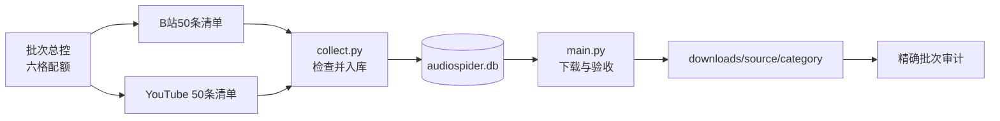
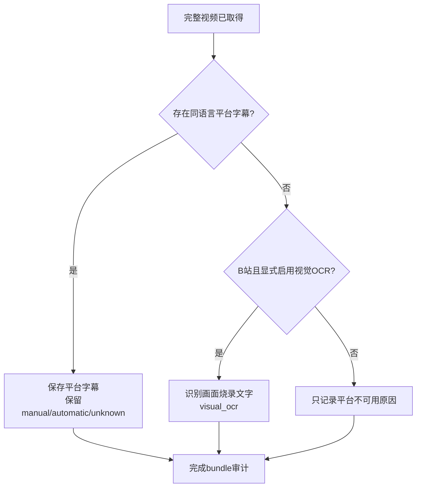

# 小白手册：采集 100 条跨平台多人视频

> 实施状态：配套 manifest、B站正式 manifest 模式、三分类、`main.py --batch-id` 和批次
> 审计器已经实现。100 条目前仍是待平台核验、人工听审和下载的候选；接口已实现不等于
> 数据已经完成。

## 1. 这次到底要得到什么

目标不是“随便下载 100 个视频”，而是下面六个格子都准确填满：

| 来源 | 影视 | 访谈/圆桌 | 会议/论坛 | 合计 |
|---|---:|---:|---:|---:|
| B站中文 | 20 | 20 | 10 | 50 |
| YouTube 英文 | 20 | 20 | 10 | 50 |
| 合计 | 40 | 40 | 20 | 100 |

目标是最终得到多人内容，但当前清单没有虚报已经确认。下载时保存平台上的完整内容：

- B站保存指定 BV 在清单边界内的每个完整分 P；
- YouTube 保存完整母视频；
- 平台本身发布的短影视片段可以很短，但仍要完整保存这一条；
- 不从长视频里再切片，不拼接，不只下载音频；
- 每条完成产物至少有 MP4、WAV 和 `metadata.json`。

## 2. 先认识四个关键词

### manifest

manifest 是“本批要处理谁”的清单，不是下载结果。它保存规范视频 ID、分类、语言、字幕
策略、说话人数审核、rights 和 AI 状态，不保存 Cookie 或临时下载地址。

### collect

`collect.py` 检查清单中的视频，把合格任务写入 `audiospider.db`。它不下载大视频。

### main

`main.py` 从 SQLite 领取任务，下载、合并和验收完整 bundle。

### audit

audit 将 manifest 的 100 个预期目标与 SQLite 和磁盘逐一对上。看到“下载进程结束”不代表
完成；六个格子数量、文件闭包和哈希都正确才算完成。

## 3. 唯一流水线



不要运行另一个“方便脚本”把文件放到别的根目录。本批也必须走
`collect.py -> audiospider.db -> main.py`。

## 4. 已实现的三个配置文件

```text
config/multispeaker_video_100_20260912.batch.json
config/bilibili_multispeaker_50_20260912.json
config/youtube_multispeaker_50_20260912.json
```

总控文件负责 100 条和六格配额，两个子文件分别列出 50 个平台目标。字段完整说明见
[批次 Manifest 参考](../reference/batch-manifests.md)。设计理由见
[跨平台 100 条多人视频批次设计](../plans/2026-09-12-multispeaker-video-batch-design.md)。

在运行任何网络命令前，静态校验必须证明：

- 三个文件存在且是合法 UTF-8 JSON；
- B站 50、YouTube 50；
- 每个平台都是影视 20、访谈 20、会议论坛 10；
- source ID 不重复；
- B站内容语言为中文，YouTube 为英文；
- 每项 `require_caption=false`；
- 未人工听审条目保持 `speaker_count=null/needs_review`，多人线索标为
  `candidate_unverified`；
- rights 和 AI 状态没有被夸大。

## 5. 为什么不能凭标题说“多人”

标题写“圆桌”可能实际只有主持人独白，标题列出三位嘉宾也可能只有一段单人口播。因此候选
阶段可以写：

```json
{
  "speaker_count": null,
  "speaker_count_status": "needs_review"
}
```

当前候选还应在 `candidate_metadata.multi_speaker_evidence.status` 写
`candidate_unverified`。后续人工核对实际视频或音轨后，才能升级成类似：

```json
{
  "speaker_count": 3,
  "speaker_count_status": "verified_manual",
  "speaker_count_evidence": {
    "method": "manual_full_media_review",
    "verified_at": "2026-09-12",
    "note": "确认至少三位不同说话者；不声明实名身份"
  }
}
```

如果没有核验，就保持 `null/needs_review/candidate_unverified` 或换一条，不能为了达到
100 把 `2` 填进去。候选允许先下载，但下载成功不会自动升级人数状态。

## 6. 第一次操作前的检查

进入服务器和仓库：

```bash
ssh dev_L4_1gpus
cd /root/code/github_repos/AudioSpider-fork
source /root/miniforge3/etc/profile.d/conda.sh
conda activate audiospider
```

检查代码、环境、进程和空间：

```bash
git status --short
git rev-parse --short HEAD
python doctor.py
python main.py stats
ps aux | grep -E 'collect.py|discover.py|main.py|backfill_bilibili_captions.py'
df -h . downloads
bash scripts/test.sh
python scripts/check_docs.py
git diff --check
```

如果同一批或同一来源已有 writer，不要再启动第二个。不要删除或复制覆盖活动中的
`audiospider.db`、WAL 或 SHM 文件。

## 7. 先验证 manifest，不要立即下载

已实现的批次审计入口不联网、不写数据库，也不下载文件：

```bash
python scripts/audit_multispeaker_batch.py \
  --batch-index config/multispeaker_video_100_20260912.batch.json
```

清单不合法时命令直接失败；合法时报告总目标 100、平台各 50、六格 expected/queued/done
以及 missing/extras。此时 `complete=false` 是尚未采集或下载时的正常事实，不要把它改写成
成功。最终自动化验收才加 `--require-complete`，使未完成返回非零。

## 8. 只采集元数据

### 8.1 B站中文 50 条

正式 Bilibili Spider 会读取精确 manifest，并仍通过统一 collector 入库：

```bash
AUDIOSPIDER_BILIBILI_MANIFEST=config/bilibili_multispeaker_50_20260912.json \
python collect.py --spiders bilibili
```

该变量非空时清单模式优先，关键词、标题词和搜索页配置不生效；清单失败也不会回退搜索。

### 8.2 YouTube 英文 50 条

```bash
AUDIOSPIDER_YOUTUBE_MANIFEST=config/youtube_multispeaker_50_20260912.json \
AUDIOSPIDER_YOUTUBE_MAX_ITEMS=50 \
python collect.py --spiders youtube
```

`collect.py` 可能因为下架、直播、时长或语言/profile 不合格而拒绝条目。拒绝项不等于
完成项；应记录原因、替换 manifest，再重新校验和采集。

## 9. 先做六个真实 canary

使用同一个精确 `batch_id`，再叠加平台和分类，六个格子各下载一条：

```bash
python main.py --batch-id multispeaker-video-100-20260912 \
  --source bilibili --category 影视 --artifact-kind video_bundle \
  --limit 1 --workers 1 --format original

python main.py --batch-id multispeaker-video-100-20260912 \
  --source youtube --category 影视 --artifact-kind video_bundle \
  --limit 1 --workers 1 --format original
```

另外四格分别把 `--category` 改为 `访谈` 和 `会议论坛`。`--batch-id` 会从 B站
`download_task.batch_id` 或 YouTube `job.batch_id` 精确过滤；旧任务、其他批次及无效旧
metadata 不会被领取。`--source/--category` 是六格切片条件，不能单独替代 `--batch-id`。

每条 canary 都要检查：

- `source.mp4` 是完整平台条目，且同时有视频和音频流；
- `audio.wav` 是 16 kHz、单声道、PCM16；
- 时长与平台完整条目一致，不是新截的 clip；
- `metadata.json` 的 source ID、job key、分类和语言正确；
- 有字幕时语言同族、人工/自动/未知标记正确；
- 无字幕时没有空 VTT/TXT；
- files 中的相对路径、字节数和 SHA-256 完整；
- `rights.status` 和 `ai_generation.status` 没有被下载成功改变。

六条都通过后，再逐步扩大为每格 5 条、10 条，最后达到目标数。不要一开始用很高并发。

## 10. 字幕怎么处理



本批是同语言字幕 best effort：

- B站中文内容只接受中文同族平台轨；
- YouTube 英文内容只接受英文同族平台轨；
- 有字幕优先保留平台人工轨，也接受并明确标注平台自动轨；
- 字幕缺失不会单独丢弃完整视频；
- HTTP/API/解析失败不能伪装为“无字幕”。

B站视频没有有效平台轨时，可以在媒体完成后单独做视觉 OCR。OCR 读的是画面像素，必须
写成 `text_source=visual_ocr`、自动提取、作者未知、人工复核状态未审核；它不能改写或
覆盖原来的 `caption.status`。当前批次不自动给 YouTube 做同类 OCR。

## 11. 文件会放在哪里

```text
downloads/
├── bilibili/
│   ├── 影视/<source_id>/<job_key>/
│   ├── 访谈/<source_id>/<job_key>/
│   └── 会议论坛/<source_id>/<job_key>/
└── youtube/
    ├── 影视/<source_id>/<job_key>/
    ├── 访谈/<source_id>/<job_key>/
    └── 会议论坛/<source_id>/<job_key>/
```

一个典型 bundle：

```text
<job_key>/
├── source.mp4
├── audio.wav
├── captions...json/vtt/txt  # 有平台字幕时
├── visual_ocr.json/vtt/txt  # 仅B站显式OCR且有结果时
└── metadata.json
```

不要在仓库外另建“方便查看”的正式副本。需要查看时直接打开上述目录；重复复制会让审计
无法判断哪个才是真实版本。

## 12. 扩量下载和续跑

扩量仍按平台、分类和精确批次集合分开运行。示意：

```bash
python main.py --batch-id multispeaker-video-100-20260912 \
  --source bilibili --artifact-kind video_bundle \
  --category 访谈 --limit 5 --workers 1 --format original

python main.py --batch-id multispeaker-video-100-20260912 \
  --source youtube --artifact-kind video_bundle \
  --category 访谈 --limit 5 --workers 1 --format original
```

注意：`--source`、`--category` 和 `--limit` 单独使用仍可能命中历史同类任务，因此本批命令
不能漏掉 `--batch-id`。每轮之后仍要运行批次审计；不能把历史完成数算入本批。

进程异常退出时：

1. 先确认旧进程真的退出；
2. 查看本批精确任务的状态和 lease；
3. 不删除 `.part`、staging、WAL 或 SHM；
4. 只对本批明确的 failed 任务做有界重试；
5. 重试后重新运行 bundle audit 和批次 audit。

例如重试本批 B站访谈格（先保持单 worker 和小 limit）：

```bash
python main.py --retry-failed --batch-id multispeaker-video-100-20260912 \
  --source bilibili --category 访谈 --artifact-kind video_bundle \
  --limit 5 --workers 1 --format original
```

## 13. Rights 和 AI 要保守写

| 字段 | 通常初值 | 小白解释 |
|---|---|---|
| `rights.status` | `needs_review` | 能播放、能下载不代表能训练、商用或再发布 |
| `ai_generation.status` | `unknown` | 没有可靠来源说明，不能判断媒体是否 AI 生成 |
| `caption.kind` | 平台证据决定 | 自动字幕只说明字幕自动生成，不说明视频由 AI 生成 |
| `speaker_count_status` | 当前候选为 `needs_review` | 只有后续人工核验才能升级为 `verified_manual` |

没有独立许可证据就保持 `needs_review`。没有来源声明或受控复核证据就保持 `unknown`。
不要为了让表格“看起来完整”填入更乐观的状态。

## 14. 最终如何证明正好 100 条

最终审计必须以批次总控和两个 manifest 为真值，而不是数目录：

```bash
python scripts/audit_multispeaker_batch.py \
  --batch-index config/multispeaker_video_100_20260912.batch.json \
  --require-complete

python scripts/audit_media_queue.py
```

第一个审计回答“本批 100 条是否一条不少、没有混入”；第二个回答“所有完成视频包是否
符合统一闭包”。两者都要通过。


最终报告至少列出：

- 两个平台和六个格子的目标、入队、完成、失败、替换数；
- 总时长、总字节、分辨率与完整视频核验；
- 同语言字幕覆盖、manual/automatic/unknown 和缺失原因；
- B站视觉 OCR 成功、无稳定文字、失败、未运行数；
- 说话人数分布及人工核验覆盖；
- rights、AI 状态及其限制；
- bundle audit failure、orphan 和 staging 数。

只有精确 100 个目标都有可解释终态，六格分别达到 20/20/10，所有 done bundle 通过
验证，才能写“完成”。

## 15. 常见错误

| 错误做法 | 为什么不行 |
|---|---|
| 看全库多了 100 条就宣布完成 | 可能混入历史任务或分类比例错误 |
| 标题有两个人名就填 speaker_count=2 | 标题不是实际音轨证据 |
| 从长电影剪 20 个短片凑影视类 | 本批要求完整平台视频，不默认切片 |
| 中文视频保存英文字幕 | 违反同语言字幕规则 |
| 没字幕就生成空 TXT | 伪造文本资产和覆盖率 |
| OCR 成功后把 caption 改成 manual | OCR 是像素派生，作者和制作方式未知 |
| 自动字幕就把媒体标成 AI | 字幕来源和媒体 AI 是两条轴 |
| 公开视频就写 rights 已授权 | 公开访问不是许可证明 |
| 直接删除 failed、staging 或数据库行 | 会破坏续跑证据和闭包 |
