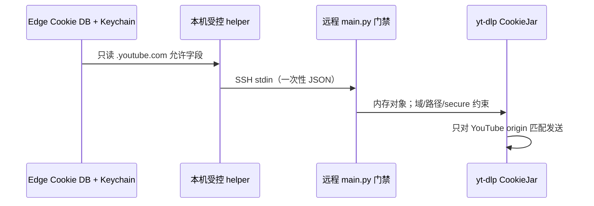

# YouTube 完整视频、WAV 与同语言字幕指南

当前 YouTube 数据的**唯一正式路径**是：

```text
受控 manifest -> collect.py -> audiospider.db -> main.py
              -> downloads/youtube/<category>/<source_id>/<job_key>/
```

正式任务下载完整母视频，不自动切 clip。`youtube_dataset.py` 是兼容、修复和审计底层
工具，不是新批次的任务编排入口，也不能再把 `downloads/youtube-candidates/` 当作正式
数据根目录。

## 1. 一个正式父视频包含什么

有同语言平台字幕时：

```text
downloads/youtube/访谈/<video_id>/<job_key>/
├── source.mp4
├── audio.wav
├── captions.en.manual.vtt       # 或 automatic
├── captions.en.manual.txt
└── metadata.json
```

没有同语言字幕且 manifest 明确写 `require_caption=false` 时：

```text
downloads/youtube/访谈/<video_id>/<job_key>/
├── source.mp4
├── audio.wav
└── metadata.json                # caption.status=missing 或 no_matching_language
```

两种情况都必须是完整母视频和完整 WAV；无字幕样本不会生成空 VTT、空 TXT，也不会用
本地 ASR 结果冒充 YouTube 平台字幕。

## 2. 运行前检查

```bash
ssh dev_L4_1gpus
cd /root/code/github_repos/AudioSpider-fork
source /root/miniforge3/etc/profile.d/conda.sh
conda activate audiospider

python doctor.py
yt-dlp --version
ffmpeg -version | head -n 1
python main.py stats
df -h .
```

工具默认不登录 YouTube、不读取浏览器 Cookie，也不绕过 DRM、会员、付费、
验证码、年龄或地区限制。网络不可达时记录失败，不把失败伪装成“无字幕”。

正式采集前先验证服务器出口：

```bash
timeout 20 curl -I https://www.youtube.com
```

若返回 `Network is unreachable` 或超时，必须先取得用户批准的合规 HTTP(S) 代理或
任务期临时受限隧道。代理地址/代理凭据只放当前进程环境，不写 `.env`、Git、
SQLite、日志或 sidecar；YouTube Cookie 则禁止进入环境变量，只经 stdin 和内存 CookieJar。

### 2.1 匿名失败后的 Edge 一次性门禁

当且仅当匿名金丝雀命中 `Sign in to confirm you’re not a bot`，且用户已明确
授权本轮使用当前 Edge 的 YouTube 会话时，可在 Mac 上执行：

先在本机三个终端准备受限网络设施（下载期间不要关）：

```bash
# 终端 A：只允许 YouTube/Googlevideo:443，默认绑定 127.0.0.1:18797
python scripts/youtube_whitelist_proxy.py

# 终端 B：在 bgutil-ytdlp-pot-provider 2.0.0 的 server 目录
node build/main.js -H 127.0.0.1 -p 4416

# 终端 C：两个远程入口也只绑定服务器回环
ssh -N \
  -R 127.0.0.1:18797:127.0.0.1:18797 \
  -R 127.0.0.1:4416:127.0.0.1:4416 \
  dev_L4_1gpus
```

白名单正反验证：允许的 YouTube 请求应能建立，无关域必须是 403；测试不带 Cookie：

```bash
curl -I -x http://127.0.0.1:18797 https://www.youtube.com/
curl -I -x http://127.0.0.1:18797 https://example.com/  # 必须 403
```

三项都通过后，再在第四个本机终端启动一次性门禁：

```bash
python scripts/run_youtube_edge_gate.py \
  --batch-id multispeaker-video-100-20260912 --category 影视 --limit 1
```

运行前要先确认回环白名单代理、PO-token provider 和 SSH 反向隧道都在；helper
只负责最小 Cookie 读取、stdin 传递、远程有界调用和事后审计，不会启动这些
网络设施。默认重试精确边界内的 `failed`；加 `--pending` 才改为领取 `pending`。
每次下载后都自动执行 Cookie 泄漏审计；`--audit-only` 可以不下载、只做该审计。



`--allow-youtube-cookie` 只允许当前
`main.py download --source youtube --artifact-kind video_bundle`，并必须显式限定
batch/category/language、`--workers 1`、不使用分组领取，也不允许 `--loop`。
helper 不会打印 Cookie，不创建 Cookie
文件，不把值放入 argv/环境变量，不复制 Edge profile，也不使用全局
`Cookie` header。`googlevideo.com`、字幕 CDN、代理、FFmpeg 和其他来源都不会收到该
Cookie。门禁不扩大账号权限，不适用于 DRM、付费、会员、年龄或地区限制。

当前受控网络栈为：

| 层 | 固定值 | 目的 |
|---|---|---|
| yt-dlp client | `mweb` | 避开已知登录 `tv_downgraded` UNPLAYABLE/重载页问题 |
| PO token provider | `bgutil-ytdlp-pot-provider==2.0.0` | 为 `mweb` 路径提供受控 PO token |
| 本机运行时 | Deno 2.9.0 / EJS 0.8.0 | 2026-09-15 已验证的 provider 执行栈 |
| CONNECT 白名单代理 | 本机与服务器均为 `127.0.0.1:18797` | 只允许 YouTube/Googlevideo 的 443 流量 |
| PO Token provider | 本机与服务器均为 `127.0.0.1:4416` | 为远程 yt-dlp 提供回环 provider endpoint |

yt-dlp 官方的当前诊断也记录了两类上游边界：登录默认可选到
`tv_downgraded`，并出现 `UNPLAYABLE`/“page needs to be reloaded”；某些响应只暴露
SABR 而没有可直下的普通格式。这些是外部平台/提取器状态，不能被重分类为
`caption.status=missing`。截至 2026-09-15，本机 provider 的 npm 依赖 `qs` 存在已知中危；因其只绑定
loopback 并由域名白名单保护，外部暴露面较小，但不是零风险，应继续跟踪上游升级。

## 3. 编写受控 manifest

正式清单建议放在 `config/`。英文访谈示例：

```json
{
  "items": [
    {
      "url": "https://www.youtube.com/watch?v=VIDEO_ID",
      "profile": "youtube_interviews",
      "content_language": "en",
      "languages": ["en"],
      "require_caption": false,
      "max_parent_duration_seconds": 3636,
      "speaker_count": null,
      "speaker_count_status": "needs_review",
      "rights": {
        "status": "needs_review",
        "source": "public_video_page",
        "evidence_url": "https://www.youtube.com/watch?v=VIDEO_ID"
      },
      "ai_generation": {
        "status": "unknown",
        "evidence": []
      }
    }
  ]
}
```

字段要点：

- `url` 只接受无凭据的单视频 URL，不接受 playlist、直播或待开播视频。
- `profile=youtube_interviews` 会按 25.5–60.6 分钟长访谈策略核验完整母视频。
- `content_language=en` 表示内容主要语言为英文。
- `languages=["en"]` 只选择英文同族字幕，不用其他语言兜底。
- `require_caption=false` 表示同语言字幕 best effort；没有时仍保留媒体。
- 旧 manifest 未显式选择 best effort 时继续保持严格字幕语义。
- `speaker_count=null` 表示尚未人工核验，不允许从标题猜人数。
- `rights.status=needs_review` 表示公开可见但权利尚未清理。
- `ai_generation.status=unknown` 与字幕是否自动生成没有因果关系。

完整父视频 profile：

| profile | 默认分类 | 时长边界 | 说话人数 schema 边界 |
|---|---|---:|---:|
| `youtube_interviews` | `访谈/interview_roundtable` | 25.5–60.6 分钟 | 2–11 |
| `youtube_screen_parents` | `影视/screen_media` | 0.418 秒–4 小时 | 1–50 |
| `youtube_conference_forums` | `会议论坛/conference_forum` | 5 分钟–4 小时 | 2–100 |

`youtube_screen_clips` 是历史/显式派生短片 profile，不用于当前完整父视频批次。profile
只规定采集边界，不自动证明实际多人；`candidate_metadata.*.status=candidate_unverified`
仍需人工听审，`speaker_count` 未核验时必须保持 null/`needs_review`。

`require_caption`、语言策略、profile 和来源修订会进入不可变 `job_key` 身份。同一个视频
采用不同策略时不会互相覆盖。

## 4. 正式采集：只入 SQLite，不下载视频

```bash
AUDIOSPIDER_YOUTUBE_MANIFEST=config/youtube_interviews_50_20260910.json \
AUDIOSPIDER_YOUTUBE_MAX_ITEMS=50 \
AUDIOSPIDER_YOUTUBE_INSPECT_TIMEOUT=120 \
python collect.py --spiders youtube
```

`collect.py` 会在可终止子进程中逐条核验：

- URL 是完整单视频且 video ID 稳定；
- 不是 live/upcoming；
- 时长符合 profile 和单项上限；
- 内容语言/字幕语言策略合法；
- 有英文人工或自动字幕时选择同语言轨；
- 没有英文字幕时，仅当 `require_caption=false` 才把无字幕事实入队。

检查队列：

```bash
python main.py stats
sqlite3 -readonly audiospider.db \
  "SELECT status,COUNT(*) FROM audio_urls WHERE source='youtube' AND artifact_kind='video_bundle' AND category='访谈' AND language='en' GROUP BY status;"
```

采集日志中的“清单 50 项”不等于“新增 50 项”：重复 `job_key` 不会重复插入，网络失败、
下架、直播或时长不合格项也不会静默算成功。

跨平台候选批次使用 `config/youtube_multispeaker_50_20260912.json`，并由
`config/multispeaker_video_100_20260912.batch.json` 与 B站 50 条清单一起对账：

```bash
AUDIOSPIDER_YOUTUBE_MANIFEST=config/youtube_multispeaker_50_20260912.json \
AUDIOSPIDER_YOUTUBE_MAX_ITEMS=50 \
python collect.py --spiders youtube
python main.py --batch-id multispeaker-video-100-20260912 \
  --source youtube --category 影视 --artifact-kind video_bundle \
  --limit 1 --workers 1 --format original
python scripts/audit_multispeaker_batch.py \
  --batch-index config/multispeaker_video_100_20260912.batch.json
```

该命令输出 expected/queued/done 等父视频数；只有实际要求不完整即失败时才加
`--require-complete`。清单存在和静态测试通过不代表 50 条已经下载。
本批下载的 `--batch-id` 不能省略：它精确匹配 YouTube 任务的 `job.batch_id`，平台和分类
只能进一步缩小范围，不能排除历史同类任务。

## 5. 正式下载：完整母视频，不生成 clip

第一次只下载一条：

```bash
python main.py --source youtube --artifact-kind video_bundle \
  --category 访谈 --language en --limit 1 --workers 1 --format original
```

通过抽查后再扩量：

```bash
python main.py --source youtube --artifact-kind video_bundle \
  --category 访谈 --language en --limit 10 --workers 2 --format original
```

`main.py` 在下载时重新解析可用格式，以最高 720p 等项目上限选择视频/音频并产出完整
MP4；随后生成 16 kHz mono PCM16 WAV。有字幕时同时获取选择的英文轨并派生 TXT。

这里不运行 `clip`。即使兼容工具还保留历史 clip 能力，也只有用户另行明确提出短片
需求时才能使用；短片不能代替或覆盖完整母视频。

## 6. 字幕 best effort 的准确含义

优先顺序是同语言人工轨，再到同语言自动轨：

| `caption.kind` | `caption.text_source` | 含义 |
|---|---|---|
| `manual` | `platform_manual` | YouTube 普通字幕轨；仍建议抽查文本质量 |
| `automatic` | `platform_auto` | YouTube 自动字幕，只能作为弱标签 |
| `unknown` | `platform_unknown` | 平台证据不足，不能擅自改成人工或自动 |

没有可接受英文轨时，best-effort sidecar 必须至少保存：

```json
{
  "caption": {
    "status": "missing",
    "kind": null,
    "text_source": null,
    "track_language": null,
    "requested_languages": ["en"],
    "required": false
  }
}
```

具体字段可能随 schema 版本增加，但以下语义不能改变：

- `missing` 表示平台没有可用字幕轨；`no_matching_language` 表示存在字幕轨、但没有英文同族轨；
- 网络/解析失败必须作为下载失败或外部错误，不能降级成 `missing`；
- 不允许创建假的 VTT/TXT 以满足文件数量；
- 如果未来另跑本地 ASR，必须用独立 provenance 和独立产物名，不能写成 `platform_*`；
- 自动字幕不证明视频内容由 AI 生成。

## 7. 断点续跑与超时

YouTube 核验和下载分别在可终止子进程内运行。常用硬超时：

| 变量 | 默认 | 含义 |
|---|---:|---|
| `AUDIOSPIDER_YOUTUBE_INSPECT_TIMEOUT` | `120` 秒 | 单视频元数据/字幕核验 |
| `AUDIOSPIDER_YOUTUBE_DOWNLOAD_TIMEOUT` | `14400` 秒 | 单完整 bundle 下载 |

中断后：

- SQLite lease 到期的 `downloading` 会按统一机制回收；
- 完整 bundle 已提交为 `done` 时不会重复下载；
- 未完成 staging 不会被计入正式完成数；
- 已保存的恢复描述不含签名 URL；
- 只对已分类的临时失败做有界重试。

```bash
python main.py --retry-failed --source youtube \
  --category 访谈 --language en --artifact-kind video_bundle \
  --limit 5 --workers 1 --format original
```

若重试本批，再加 `--batch-id multispeaker-video-100-20260912`，避免领取历史 failed 行。

## 8. 统一审计与抽查

```bash
python scripts/audit_media_queue.py
```

该命令统一验证 YouTube 与 B站所有 `done video_bundle`：数据库/目录身份、MP4/WAV、
字幕闭包、sidecar、字节数、SHA-256、content hash 和孤儿目录。

抽查一个父视频：

```bash
ffprobe -v error -show_streams -show_format \
  downloads/youtube/访谈/<video_id>/<job_key>/source.mp4
ffprobe -v error -show_streams -show_format \
  downloads/youtube/访谈/<video_id>/<job_key>/audio.wav
python -m json.tool \
  downloads/youtube/访谈/<video_id>/<job_key>/metadata.json
```

重点确认：视频时长是完整父视频、MP4 同时有视频与音频流、WAV 是 16 kHz mono PCM16、
字幕语言为英文、`kind/text_source` 配对正确、无字幕样本没有伪造字幕文件。

## 9. 权利、说话人数与 AI 状态

- 公开视频不等于允许批量下载、训练、公开数据集或商业再分发。
- `rights.status=needs_review` 不是已获权；必须保留并由数据负责人/法务审核。
- 未人工核验时 `speaker_count=null`、`speaker_count_status=needs_review`。
- `caption.kind=automatic` 只描述文本轨，不设置媒体 `ai_generation.status`。
- 听感或模型输出最多支持 `suspected`，不能冒充来源声明。

## 10. standalone CLI 什么时候还能用

`youtube_dataset.py` 只用于：

- 修复旧父 bundle 的可确定派生字段；
- 审计或迁移历史 standalone 数据；
- 为统一 handler 提供底层验证函数；
- 用户明确要求的隔离兼容实验。

新任务必须由 `collect.py` 入 `audiospider.db`，再由 `main.py` 下载到
`downloads/youtube/...`。旧目录使用 `scripts/migrate_video_bundles.py` 默认 dry-run，
确认后才 `--apply`，迁移结束再跑统一审计。

新跨平台候选批次见[100 条跨平台多人视频小白手册](multispeaker-video-batch-100.md)；
历史 100+50 访谈任务仍见
[150 个中英文完整访谈批次运行手册](interview-batches-150.md)。
