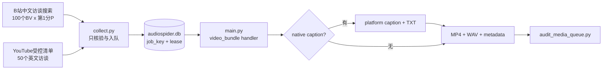

# 150 个中英文完整访谈批次设计

## 目标

通过唯一正式链路采集并下载两个有界批次：

- B站中文访谈新增 100 个完整视频；
- YouTube 英文访谈目标 50 个完整母视频；
- 字幕必须与内容语言同族，但本批为 best effort，无字幕也保留视频；
- 每个任务都经过 `collect.py -> audiospider.db -> main.py -> downloads/<source>/<category>/`。

## 方案比较

### A. 使用 standalone dataset CLI

实现最快，但会绕开 SQLite 认领、lease、重试和统一目录，违反已确定的架构，拒绝。

### B. 无字幕时生成本地 ASR 伪装为平台字幕

可以提高文本覆盖，但会混淆 `platform_*` provenance，且超出“尽量获取平台字幕”的本次范围，拒绝。

### C. 推荐：同一队列的字幕 best-effort 策略

清单显式保存 `require_caption=false`。核验仍必须确认完整单视频、内容语言、时长、非直播与权利状态；若有同语言平台字幕则下载并记录人工/自动 provenance，否则只产出 MP4、WAV 和明确 `caption.status=missing` 的 sidecar。

## 数据流

## 批次控制

- B站使用中文内容语言、访谈关键词、5 页搜索、100 个 BV、每 BV 只取第 1 分 P。
- YouTube 只读经核验的 50 项 manifest，每项 `profile=youtube_interviews`、`content_language=en`、`require_caption=false`。
- 入队前记录 DB baseline，下载时按 source/artifact 过滤，完成后用 batch job key 计数，不用全库总数冒充本批成果。
- B站 Cookie 仅由本机已登录浏览器在已授权情况下一次性注入当批进程，不落盘。

## 完成条件

1. 目标批次每条都是 `done` 或有结构化失败原因，不得沉默丢失。
2. 所有 `done` 包都有可解码的完整 MP4、16 kHz mono PCM16 WAV 与闭包哈希。
3. 有字幕时语言同族且 provenance 正确；无字幕时不生成假文本。
4. `scripts/audit_media_queue.py` 失败 0、孤儿 0。
5. 报告 B站/YouTube 完成数、失败数、字幕覆盖、manual/automatic/missing、时长和字节数。
