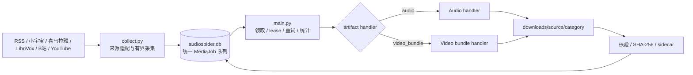
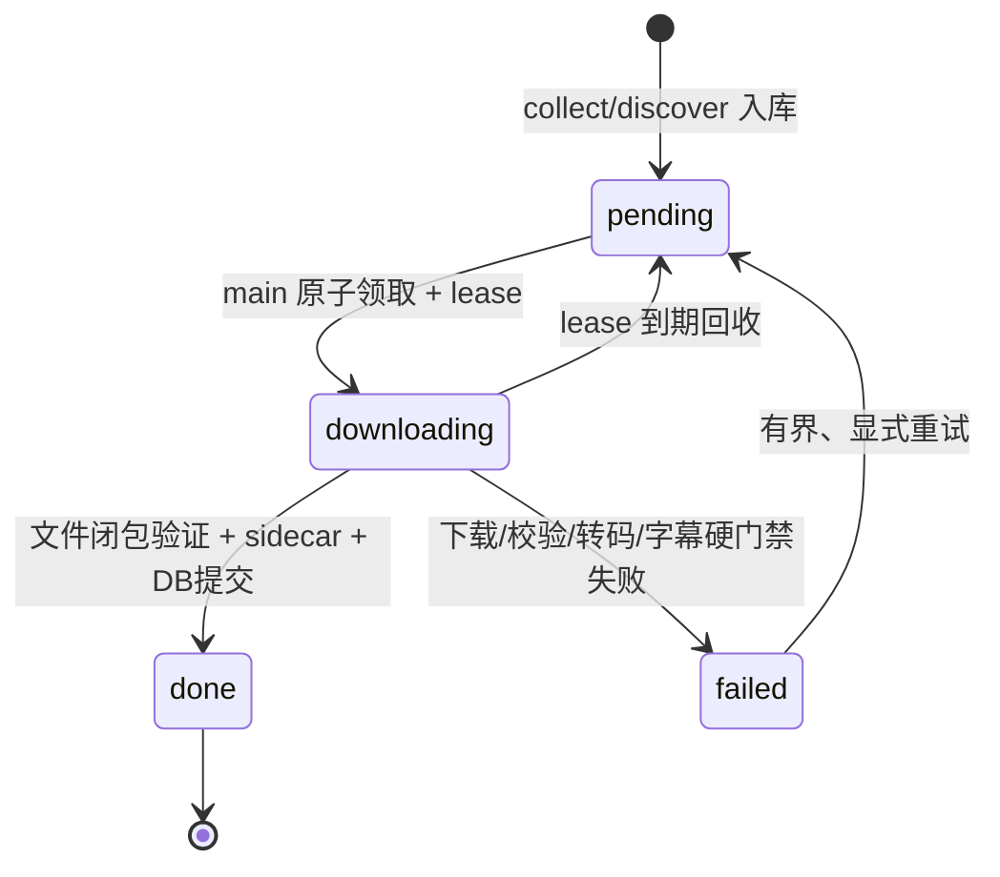
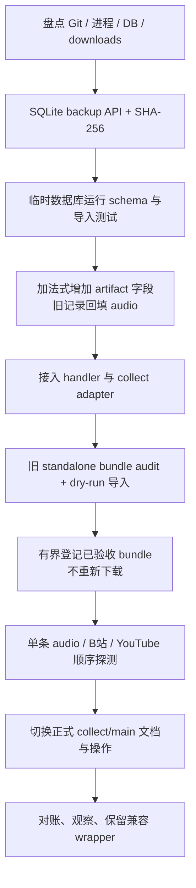

# AudioSpider 统一媒体流水线设计

## 1. 状态

本文记录已经实现的统一架构。普通音频、B站完整分P和 YouTube 完整母视频均走
`collect.py -> audiospider.db -> main.py`；standalone dataset CLI 只保留兼容、修复
和审计用途。`artifact_kind=video_bundle` 由 `media_artifacts.py` 在统一 claim/lease
之后分派。

相关决策见 [ADR-002](../design/adr-002-unified-media-artifacts.md)，实施步骤见
[统一媒体流水线实施计划](2026-09-10-unified-media-pipeline.md)。

## 2. 问题与目标

统一前仓库有三条编排路径：

- 普通音频：Spider 写 SQLite，`main.py` 下载；
- B站视频：`bilibili_dataset.py` 读取 manifest 并直接下载；
- YouTube 视频：`youtube_dataset.py` 读取 manifest 并直接下载。

三条路径都需要任务上限、重试、lease、状态统计、目录约束、字幕来源、版权状态、
安全下载和验收，却分别实现。当前实现已把“任务编排”合成唯一主路径，同时允许
不同媒体产物使用不同 handler 和目录闭包。

### 2.1 已实现行为

1. 所有来源由 `collect.py` 归一化并写入同一个 `audiospider.db`。
2. 所有正式下载由 `main.py` 原子领取、执行、验收并提交状态。
3. 普通音频行为与目录保持兼容。
4. B站采集默认创建 `video_bundle` 任务；保留画面、音频、WAV 和可得平台字幕。
5. YouTube 只保存完整母视频，不默认生成 clip。
6. 字幕语言与内容语言分别记录，并执行同语言族策略。
7. 字幕人工/自动/unknown 与媒体 AI 来源完全独立。
8. standalone dataset CLI 已降级为兼容/诊断工具，不再是正式主入口。

### 2.2 非功能目标

- 单机优先，不引入外部队列或服务型数据库；
- SQLite 任务领取事务化，允许 lease 到期恢复；
- 签名 URL 不作为幂等身份，不持久化查询参数；
- 任一 `done` 视频任务必须是完整 bundle，而不是单个已下载文件；
- 每个输出都有 SHA-256、字节数和可复算 sidecar；
- 默认有界：任务数、分 P 数、时长、分辨率、单流、bundle、字幕和磁盘水位均有限；
- 当前外部平台失败必须如实记录，不能伪装成“无字幕”或成功。

### 2.3 非目标

- 不建设分布式调度系统；
- 不在本次架构中引入对象存储；
- 不通过登录绕过、DRM、验证码或会员限制；
- 不把平台字幕称为 ASR 结果；
- 不把公开可访问自动解释为允许训练、商业使用或再分发；
- 不把 YouTube clip 重新设为默认产物。

## 3. 统一架构



`discover.py` 仍可用于发现播客 feed，但解析出的正式任务同样进入
`audiospider.db`。它不是另一条下载管线。

## 4. 统一任务模型

逻辑模型命名为 `MediaJob`。现有 `audio_urls` 表保留表名，新增
`artifact_kind`、`bundle_path` 和 `job_key`。旧库在单个 SQLite 事务内重建表约束：
旧记录回填为 `audio`，去掉不适用于多任务的全局 URL unique，再建 partial unique 索引。

### 4.1 公共字段

| 字段 | 含义 |
|---|---|
| `id` | 数据库内部 ID |
| `source` | `podcast_rss`、`bilibili`、`youtube` 等 |
| `source_id` | 平台稳定 ID；不使用签名 URL |
| `artifact_kind` | `audio` 或 `video_bundle` |
| `job_key` | 绑定平台对象、CID/profile、字幕/画质策略和来源修订的不可变任务键 |
| `category` | 输出目录分类 |
| `title` | 人类可读标题，不直接作为唯一身份 |
| `language` | 音视频实际主要语言；视频任务未知为 `und` |
| `metadata_json` | 版本化来源参数和 handler 输入，不含凭据/签名 URL |
| `status` | `pending`、`downloading`、`done`、`failed` |
| `claimed_by/claimed_at/lease_expires_at` | 原子领取和恢复 |
| `local_path` | 普通音频文件或视频 bundle 中的 `source.mp4` |
| `bundle_path` | 视频 bundle 根目录；普通音频为空 |
| `content_hash` | 音频文件 SHA-256 或 bundle 清单 SHA-256 |

普通音频旧记录回填 `artifact_kind=audio`。B站和 YouTube 的
`metadata_json.source_data` 保存平台 ID、具体 part/CID 或 video ID、内容语言、字幕
语言策略、画质/时长上限、rights、AI 来源状态和 source revision。

### 4.2 幂等身份

视频任务逻辑身份：

```text
(source, artifact_kind, job_key)
```

- `job_key=''` 的旧音频仍使用 URL partial unique 约束；
- `job_key!=''` 的视频按 `(source, artifact_kind, job_key)` partial unique，同 URL 多策略可共存；
- B站 `source_id` 为 `BV..._pN`，下载前再次解析并核对具体 CID；
- YouTube `source_id` 使用 video ID；
- live/signed media URL 仅用于当次传输；
- source revision 和 job key 保留在平台 job/sidecar，决定具体输出闭包。

## 5. 来源与默认产物

| 来源 | 默认 `artifact_kind` | 正式产物 |
|---|---|---|
| Podcast RSS | `audio` | 原音频或 Opus、sidecar、可选公开背景资产 |
| 小宇宙 | `audio` | 同上 |
| 喜马拉雅 | `audio` | 同上 |
| LibriVox | `audio` | 同上，并保留公版来源证据 |
| B站 | `video_bundle` | 完整分P MP4、16 kHz WAV、零或多条字幕、sidecar |
| YouTube | `video_bundle` | 完整母视频、16 kHz WAV、同语言平台字幕、sidecar |

B站纯音频只兼容数据库中的历史 `audio` 记录；新采集默认 `video_bundle`。

YouTube 正式下载到完整母视频为止。历史 clip 只属于显式授权的派生工作流，不能
由 `collect.py` 或 `main.py` 默认触发。

## 6. Handler 边界

### 6.1 Audio handler

复用现有 downloader 行为：

1. 安全验证 URL/DNS/重定向；
2. 有界 `.part` 下载和 Range 恢复；
3. ffprobe 验证；
4. 可选转 Opus；
5. 最终文件 SHA-256 去重；
6. 保存 sidecar 和受限背景资产；
7. 提交数据库 `done`。

### 6.2 Video bundle handler

平台 adapter 负责解析平台元数据，公共 bundle runner 负责生命周期：

1. 用稳定 ID刷新 view/player/playurl 或 yt-dlp structured info；
2. 选择受限的视频、音频和字幕表示层；
3. 下载到 `downloads/<source>/<category>/.staging/<job-key>/`；
4. 合并完整 MP4；
5. 抽取 16 kHz、单声道、PCM16 WAV；
6. 保存移除传输凭据后的平台字幕及确定性 VTT/TXT；
7. 生成 `metadata.json` 和文件闭包；
8. 完整 audit 后原子提升到正式 bundle；
9. 数据库 `local_path` 指向 `source.mp4`、`bundle_path` 指向 bundle 根，随后提交
   `done`。

平台模块保留差异：B站 DASH/字幕登录门禁与 CID；YouTube yt-dlp 格式和人工/自动
字幕字典。公共 handler 不应抹平这些事实。

## 7. 目录契约

```text
downloads/
├── podcast_rss/
│   └── 教育/
│       ├── <audio-id>.mp3
│       ├── <audio-id>.json
│       └── <audio-id>.description.txt
├── xiaoyuzhou/
│   └── 播客/
│       └── ...
├── librivox/
│   └── 有声书/
│       └── ...
├── bilibili/
│   └── 访谈/
│       └── <source-id>/
│           └── <job-key>/
│               ├── source.mp4
│               ├── audio.wav
│               ├── captions.<lang>.<kind>.<id>.json
│               ├── captions.<lang>.<kind>.<id>.vtt
│               ├── captions.<lang>.<kind>.<id>.txt
│               └── metadata.json
└── youtube/
    └── 访谈/
        └── <source-id>/
            └── <job-key>/
                ├── source.mp4
                ├── audio.wav
                ├── captions.<lang>.<kind>.vtt
                ├── captions.<lang>.<kind>.txt
                └── metadata.json
```

所有路径必须由受控 source/category/stable ID组成。远端标题只进入 sidecar，不直接
决定目录边界。视频临时文件必须留在同一 source/category 下的隐藏 staging 根，方便
同文件系统原子提升和按来源清理。

## 8. 状态与恢复



字幕的 `auth_required`、`not_provided_publicly`、`no_matching_language` 和 `unknown`
是 artifact 内部事实，不新增为全局队列状态。`require_caption=false` 时媒体可完成；
`require_caption=true` 时没有合格字幕会使任务 `failed`，并保留稳定错误码。

视频 bundle 只有在全部必需 payload 和 audit 通过后才能 `done`。单条字幕下载失败
是否为硬失败由任务中的字幕策略决定，不能用普通音频的“背景资产 best effort”规则
自动覆盖。

## 9. 字幕、语言和 AI 来源

### 9.1 独立字段

```text
content_language       音视频主要语言
caption.language       字幕轨语言
caption.kind           manual | automatic | unknown
caption.text_source    platform_manual | platform_auto | platform_unknown
caption.translation    normal | automatic_translation | unknown
ai_generation.status   declared | not_declared | suspected | unknown
```

这些字段不能互相推导：

- 自动字幕不证明媒体由 AI 生成；
- `platform_manual` 只表示平台 CC 通道和可核对作者证据，不等于逐字人工验真；
- 听感或模型分数只能支持 `suspected`，不能升级为 `declared`；
- B站 `need_login_subtitle=true` 且空轨道必须记为 `auth_required`；
- YouTube `subtitles` 与 `automatic_captions` 必须分别保存来源；
- 中文/普通话/粤语内容使用中文文本族字幕；英语、日语、韩语等使用本语言字幕；
- 不允许用英文字幕兜底中文视频。

### 9.2 YouTube 完整母视频

YouTube handler 必须保存整段媒体和整段字幕。`clip` 不在默认任务图中；若未来执行
显式 clip，必须产生独立派生记录并引用父 bundle 哈希，不能覆盖或冒充母视频。

## 10. 安全与版权

- URL 仅允许受控 HTTPS host；DNS 与每次重定向都重新验证公网地址；
- 拒绝 loopback、私网、link-local、凭据 URL和未知协议；
- Bilibili Cookie 只有用户明确授权时才注入，只发往 `api.bilibili.com`；
- 不读取浏览器 Cookie，不在命令、日志、数据库或 sidecar 中保存 Cookie；
- yt-dlp/ffmpeg 子进程使用最小环境，不继承爬虫凭据；
- 媒体、字幕、manifest、单任务和磁盘保留空间均有硬上限；
- 禁止把签名媒体/字幕 URL query 写进持久化数据；
- `rights.status` 默认 `needs_review`；平台公开可看和 B站 `copyright` 值都不自动清权；
- 代码 MIT License 不授权所采集内容；正式训练/商业/再分发前独立审核授权、隐私和
  平台条款。

## 11. 可观测性与验收

统一统计至少按 source、artifact kind、status、caption status/kind、rights status、
AI generation status 聚合。每次真实批次报告：host、commit、命令、上限、任务数、
新增/成功/失败、输出 bytes、字幕分类和未清权数量。

当前可以运行的仓库验证命令：

```bash
bash scripts/test.sh
python scripts/check_docs.py
python doctor.py
python main.py stats
git diff --check
```

统一实现需要持续通过：

- 普通音频回归；
- B站默认 `video_bundle` 队列闭包；
- YouTube 完整母视频队列闭包；
- lease/断点/重跑幂等；
- 字幕语言和 provenance；
- 旧 standalone bundle 导入但不重下；
- 全库迁移前后计数与路径一致。

## 12. 失败模式

| 失败 | 影响 | 缓解 |
|---|---|---|
| SQLite 锁冲突 | 领取或提交延迟 | 小事务、单写者原则、指数退避 |
| 进程退出 | `downloading` 与 staging 遗留 | lease 回收、job key、`.part` 恢复 |
| 签名 URL 过期 | 下载 403/失效 | 用稳定 ID刷新，不把 URL 当身份 |
| 视频/音频表示层变化 | 错误续传 | resume 绑定无签名表示层 fingerprint |
| 字幕登录门禁 | 无法判断或下载字幕 | `auth_required`，不伪装无字幕 |
| 字幕语言不匹配 | 训练标签错误 | manifest/选择/sidecar/audit 四层校验 |
| 磁盘不足 | 半成品和大面积失败 | 预估、硬水位、staging 清点、有界批次 |
| sidecar 与文件漂移 | 数据不可审计 | SHA-256 闭包、净化平台字幕可重建派生文本 |
| 迁移重复入库 | 重复下载 | 稳定唯一键、dry-run、计数对账 |

## 13. 迁移流程



每一阶段都必须可停止：若 schema、计数、路径、字幕语言或 artifact audit 不一致，
停止新视频采集，让 `main.py` 只消费旧 `audio`，保留加法字段和备份，不做破坏性
回滚。兼容 CLI 只有在正式主路径经过真实小批验证后才可降级或移除。

## 14. 已落地决策

实现采用以下结果：

1. 在 `audio_urls` 加 `artifact_kind`、`bundle_path`、`job_key`；保留表名并事务式重建唯一索引。
2. B站历史纯音频任务保留 `audio`，新采集默认 `video_bundle`。
3. `scripts/migrate_video_bundles.py` 默认 dry-run；`--apply` 先备份、再移动和登记。
4. `main.py --artifact-kind audio|video_bundle` 可精确选产物；仅指定 B站/YouTube 来源时默认为 `video_bundle`。
5. B站字幕按 `require_caption` 决定硬门禁；YouTube adapter 只把具备合格同语言字幕的
   完整母视频入队。
