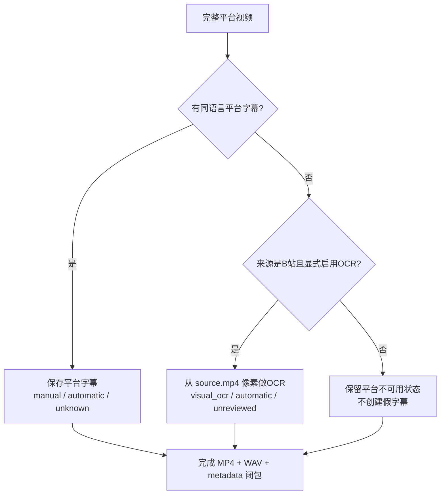

# 跨平台 100 条多人视频批次设计

> 状态：接口与候选清单已实现。本文定义运行和验收合同；不表示候选已经人工听审、下载或
> 通过 bundle 验收。

## 1. 目标

建设一个固定、可复现、可续跑、可审计的 100 条多人视频批次：

| 平台 | 内容语言 | 影视 | 访谈/圆桌 | 会议/论坛 | 合计 |
|---|---|---:|---:|---:|---:|
| B站 | 中文同族 | 20 | 20 | 10 | 50 |
| YouTube | 英文 | 20 | 20 | 10 | 50 |
| 合计 | — | 40 | 40 | 20 | 100 |

本设计中的“一条”指一个平台父条目：B站是一个明确 BV，YouTube 是一个完整母视频。
B站一个父 BV 可在 `max_parts` 边界内产生一个或多个完整分 P bundle。影视候选可以是平台
本身发布的短片段，但必须完整保存该平台条目或完整分 P；系统不得从长视频中另切 clip、
拼接片段或只保留音频。

每个完成的任务继续产生 `video_bundle`，至少包含完整 MP4、16 kHz 单声道 PCM16 WAV
和 `metadata.json`。同语言平台字幕采用 best effort：能获取就保存并标明人工、自动或
未知；不能获取仍保留完整视频，并保存准确的不可用原因。

## 2. 不做什么

- 不创建第二套下载器、数据库或 `datasets/` 根目录。
- 不用 standalone dataset CLI 代替正式队列。
- 不把标题中的“双人”“圆桌”等词当作说话人数事实。
- 不用英文字幕给中文视频兜底，也不用中文字幕给英文视频兜底。
- 不把画面 OCR、ASR 或自动翻译冒充平台人工字幕。
- 不因公开视频可播放，就把权利状态写成已授权。
- 不因未发现 AI 声明，就写成“确定非 AI”。

## 3. 方案选择

### 方案 A：直接按平台和分类运行六次 `main.py --limit`

实现成本最低，但同一分类中可能已有历史任务，`--limit` 不能证明领取的是本批目标；搜索
结果也会随时间变化，无法准确复现 20/20/10。拒绝作为正式方案。

### 方案 B：为本批创建独立下载脚本和目录

可以快速得到文件，但绕开 SQLite claim、lease、恢复、统一 sidecar 与 audit，违反项目
已经确定的唯一主路径。拒绝。

### 方案 C：推荐——批次总控加两个平台子 manifest

用一个批次总控文件固定六格配额、平台子清单路径和共同策略；两个平台适配器仍通过
`collect.py` 将经过验证的任务写入同一个 `audiospider.db`，再由 `main.py` 下载。批次
身份写入不可变任务策略，最终按 manifest 的精确 source ID/job key 集合验收。

该方案增加的是“输入与对账边界”，不是新流水线。

## 4. 统一架构


正式路径仍是：

```text
manifest -> collect.py -> audiospider.db -> main.py -> downloads/<source>/<category>/
```

批次总控只声明目标，不直接下载。子 manifest 只包含无凭据的规范来源标识和经过审核的
选择证据，不保存 Cookie、短期媒体 URL、代理地址或签名参数。

## 5. 批次与任务身份

建议批次标识固定为：

```text
multispeaker-video-100-20260912
```

已实现文件：

```text
config/multispeaker_video_100_20260912.batch.json
config/bilibili_multispeaker_50_20260912.json
config/youtube_multispeaker_50_20260912.json
```

批次总控记录两个子 manifest 的仓库内相对路径、平台目标数和三类配额。每个条目
至少有 `source_revision`、`content_kind`、`category`、内容语言、字幕策略、说话人数、
rights 和 AI 状态。`source_revision` 应绑定批次标识并参与 `job_key`，但验收仍以完整
manifest 目标集合为准；只比较数据库最大 ID 或全库总数不够精确。

六个格子的受控值为：

| `content_kind` | `category` | 含义 |
|---|---|---|
| `screen_media` | `影视` | 平台条目本身是影视、节目或剧情片段 |
| `interview_roundtable` | `访谈` | 访谈、对谈、圆桌或播客式多人交流 |
| `conference_forum` | `会议论坛` | 会议、论坛、峰会、研讨或 panel |

同一平台 source ID 不得跨格重复。替换失效候选时，必须先更新 manifest 和校验摘要，再
重新采集；不能通过多下载几条来掩盖缺口。

## 6. “多人”的事实门禁

当前 100 条是候选发现批次，允许 `speaker_count=null`、
`speaker_count_status=needs_review`。标题、节目形态等线索保存在
`candidate_metadata.multi_speaker_evidence`，状态必须是 `candidate_unverified`；搜索词、
标题、缩略图和嘉宾列表都不能证明实际音轨中有几个人说话。

下载候选不等于把它认证成多人样本。只有人工核对实际视频或音轨后，才能另行写入至少 2
且符合 profile 上限的整数人数及 `verified_manual` 证据。无法确认时保留
`needs_review/candidate_unverified` 或替换，不能填猜测值凑数。

“多人”表示该完整条目中确认至少两位可区分的说话者，不承诺逐帧说话人分离，也不等于
每位说话者都已实名。若未来使用模型估计人数，最多先标为待复核证据；在人工确认前不能
升级为 `verified_manual`。

## 7. 完整视频和三类内容

### 7.1 影视

影视条目可以很短，但下载对象仍是平台上的完整视频。若平台条目本身是 12 秒的影视片段，
保存完整 12 秒；若来源是两小时电影，不因本批需要短内容而自行截取 12 秒。后者应换成
平台已经独立发布、权利状态可继续复核的候选。

### 7.2 访谈/圆桌

优先多人对话、圆桌或多嘉宾长访谈。时长、人数和非直播门禁由 profile 与 manifest
共同约束。完整母视频不裁剪片头、片尾或沉默段。

### 7.3 会议/论坛

必须单独归入 `会议论坛`，不能为了复用旧映射全部落到 `访谈`。若候选不符合现有长视频
profile 的时长或人数边界，应先定义和测试新的有界 profile，不得静默放宽限制。

## 8. 字幕与视觉 OCR 决策



下载领取必须带批次过滤；再叠加平台和分类即可得到六个精确批次切片：

```bash
python main.py --batch-id multispeaker-video-100-20260912 \
  --source bilibili --category 影视 --artifact-kind video_bundle --limit 1 --workers 1
python main.py --batch-id multispeaker-video-100-20260912 \
  --source youtube --category 影视 --artifact-kind video_bundle --limit 1 --workers 1
```

其余四格替换平台和分类逐格执行。`--batch-id` 从两平台 SQLite 任务元数据精确匹配，旧任务
和其他批次不会被领取；`--source/--category` 不能单独替代它。

字幕策略统一为 `require_caption=false`，但 best effort 不等于“忽略字幕”：

- B站中文视频只接受中文、普通话或粤语同族字幕；
- YouTube 英文视频只接受英文同族字幕；
- 平台字幕必须保留 `kind` 与 `text_source` 的来源配对；
- 平台无字幕、需要登录、语言不匹配、轨道无效和网络失败必须分开；
- 网络或解析失败是任务失败，不能改写成“平台没有字幕”；
- B站视觉 OCR 只在没有有效同语言平台轨时运行，并写入
  `derived_text.visual_ocr`；它不改变 `caption.status`；
- 当前批次不把 YouTube 画面文字自动 OCR 成字幕，除非另有设计和实现。

## 9. 产物目录

```text
downloads/
├── bilibili/
│   ├── 影视/<source_id>/<job_key>/
│   ├── 访谈/<source_id>/<job_key>/
│   └── 会议论坛/<source_id>/<job_key>/
└── youtube/
    ├── 影视/<source_id>/<job_key>/
    ├── 访谈/<source_id>/<job_key>/
    └── 会议论坛/<source_id>/<job_key>/
```

每个目录至少包含：

```text
source.mp4
audio.wav
metadata.json
```

有平台字幕时再加入字幕 JSON/VTT/TXT；B站无有效平台字幕且明确执行 OCR 时，可能加入
`visual_ocr.json/.vtt/.txt`。所有正式 payload 都必须登记相对路径、字节数和 SHA-256。

## 10. Rights、AI 和字幕来源是独立轴

| 轴 | 默认值 | 不能据此推导 |
|---|---|---|
| `rights.status` | `needs_review` | 可播放不等于可训练、再分发或商用 |
| `ai_generation.status` | `unknown` | 自动字幕不等于媒体由 AI 生成 |
| `caption.kind` | 平台证据决定 | `manual` 不等于逐字人工验真 |
| `speaker_count_status` | 候选为 `needs_review` | 标题和嘉宾名单不等于实际说话人数 |

只有可复核授权证据才能提升 rights。只有来源明确声明、或另有受控检测与人工复核时，才
能改变 AI 状态；“没有看到声明”不能写成 `not_declared` 的技术证明。

## 11. 精确批次对账


最终报告必须同时给出：

- manifest 总数、平台数、三类配额和唯一 source ID 数；
- inspect 接受、拒绝、未入队及替换原因；
- 精确 job key 的 pending/downloading/done/failed 数；
- 每个 done bundle 的 MP4/WAV、字幕、sidecar、bytes/SHA-256 验收；
- 六个格子的完成数、总时长、总字节和字幕覆盖；
- manual/automatic/unknown、平台无字幕原因和 B站 OCR 状态；
- speaker_count、rights、AI 与人工复核状态；
- 全库统一 audit 的 failure/orphan/staging 数。

只有 100 个目标全部有可解释终态，且六格分别达到 20/20/10，才能宣布批次完成。历史
同类任务、worker 退出码、全库总数或目录文件数量都不能替代精确对账。

## 12. 失败处理

| 阶段 | 失败例子 | 处理 |
|---|---|---|
| manifest | 数量、分类、语言或候选状态不合格 | 整批校验失败，不入库 |
| inspect | 下架、直播、时长/profile 不符 | 记录拒绝原因，人工替换候选 |
| collect | API 临时失败 | 有界重试；不得伪造任务 |
| download | 网络、空间、媒体合并失败 | 保留 failed/staging，分类后小批重试 |
| caption | 同语言字幕确实不存在 | best effort 保留视频并写真实状态 |
| audit | 文件缺失、哈希不符、孤儿目录 | 不算完成，修复精确任务后重审计 |

已有 writer 运行时不得部署改变身份或分类规则的代码，也不得全局重置
`downloading -> pending`。恢复必须限定本批的精确 source ID/job key 集合。

## 13. 测试与实施门禁

实现至少需要验证：

1. 三份 manifest 的 schema、100/50/50 和六格配额；
2. source ID 全局唯一，且不与已明确排除的旧批次重复；
3. 中英文内容和字幕语言策略正确；
4. 未核验候选保持 `speaker_count=null/needs_review` 和 `candidate_unverified`，不虚报人数；
5. B站 manifest 通过正式 Spider 进入统一队列，而不是 standalone 下载；
6. YouTube 分类来自受校验条目，不被 profile 硬编码覆盖；
7. 字幕缺失在 best-effort 下仍形成合法完整视频闭包；
8. B站 OCR 仅作为无有效平台字幕后的独立回填；
9. 批次审计能发现缺项、错格和历史任务混入，统一 bundle 审计能发现损坏产物；
10. 文档链接、Markdown、完整测试和真实双平台 canary 全部通过。

建议顺序是：静态 manifest 测试，两个平台各三类各一个 inspect canary，再使用
`--batch-id` 叠加平台与分类分别做六个真实下载 canary，六格各小批，最后扩到 100；任何
阶段失败都先修复事实或边界，不降低门禁凑数。
