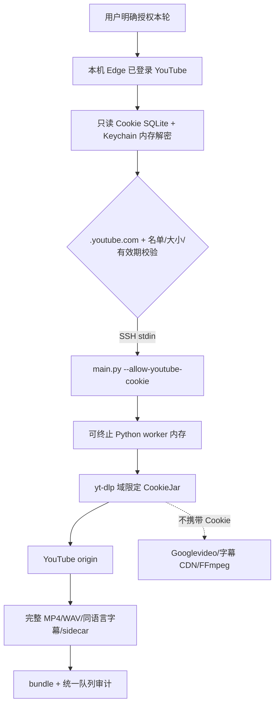

# YouTube Edge Cookie 门禁与 100 条批次续跑报告

> 日期：2026-09-15
>
> 批次：`multispeaker-video-100-20260912`
>
> 结论状态：两个真实 canary 已通过，固定批次正在由唯一写入器续跑；本文只记录已审计数字

## 1. 为什么增加这个门禁

YouTube 匿名路径已经保留并仍是默认。本批 YouTube 影视格的剩余任务在可达的
网络通路上仍返回 `Sign in to confirm you’re not a bot`。这不是“没有字幕”，
也不是可以写成 `done` 的结果。在用户明确授权当前任务使用其已登录 Edge
YouTube 会话后，项目新增一条严格限定的一次性身份分支。

它不是第二条下载流水线。任务仍然经过：

```text
manifest -> collect.py -> audiospider.db -> main.py
         -> downloads/youtube/<category>/<source_id>/<job_key>/
```

## 2. 截至 canary 启动前的真实基线

| 来源 | 分类 | 预期父视频 | 已完成 | 待解释差额 |
|---|---|---:|---:|---:|
| B站 | 影视 | 20 | 20 | 0 |
| B站 | 访谈 | 20 | 20 | 0 |
| B站 | 会议论坛 | 10 | 10 | 0 |
| YouTube | 访谈 | 20 | 20 | 0 |
| YouTube | 会议论坛 | 10 | 10 | 0 |
| YouTube | 影视 | 20 | 8 | 12 |
| **合计** |  | **100** | **88** | **12** |

静态批次对账中 `missing=[]` 且 `extras=[]`，说明预期身份集没有混入或丢失；
它不代表剩余 12 条已完成。在启用登录态之前，对 4 个 YouTube 影视失败项做了
匿名真实复查，4/4 均即时返回 bot challenge。

## 3. 数据和凭据怎么流动



这条路径同时实施以下禁止项：

- 不生成 Netscape、JSON 或任何形式的 Cookie 文件；
- 不使用 `--cookies-from-browser`，不复制 Edge profile；
- 不把 Cookie 值放入 argv、shell 历史、环境变量或输出；
- 不使用全局 `Cookie` header，不绕过 CookieJar 的域、路径、secure 与过期规则；
- 不把 YouTube Cookie 发往 Googlevideo、静态/字幕 CDN、代理、FFmpeg、B站或其他任务；
- 不把 Cookie、完整签名 URL 或未脱敏错误写入日志、SQLite、sidecar、下载目录或 Git。

`main.py --allow-youtube-cookie` 只能对当前 YouTube `video_bundle` 下载启用，必须显式限定
batch/category/language、`--workers 1`、不使用分组领取，也不允许 `--loop`。
门禁失败时必须在领取 SQLite 任务前终止。

## 4. 网络、yt-dlp 与 PO token 运行栈

| 组件 | 本轮固定值 | 备注 |
|---|---|---|
| yt-dlp 授权 client | `mweb` | 匿名路径仍用 yt-dlp 默认；只授权分支固定 `mweb` |
| PO-token provider | `bgutil-ytdlp-pot-provider==2.0.0` | 不在长批次中临时更新 |
| provider 运行时 | Deno 2.9.0 / EJS 0.8.0 | 本机 loopback 运行 |
| CONNECT 反向通道 | 本机与服务器都使用 `127.0.0.1:18797` | 两端不做异号映射 |
| provider 反向通道 | 本机与服务器都使用 `127.0.0.1:4416` | 两端不做异号映射 |
| 代理出口 | YouTube/Googlevideo 所需域名白名单 | 无关 HTTPS 域必须被 403 拒绝 |

“代理允许 Googlevideo 媒体流量”不等于“Cookie 允许发给 Googlevideo”：前者是网络白名单，
后者由 CookieJar 域规则单独阻断。

## 5. 已知上游边界和剩余风险

### `tv_downgraded` 与 SABR

yt-dlp 官方当前的实现/诊断显示：登录默认可展开到 `tv_downgraded` client，并产生
`UNPLAYABLE` 或“page needs to be reloaded”；部分响应只暴露 SABR，没有可直下的普通
format。本轮授权分支固定 `mweb` 并保留脱敏 format ID 证据，但不伪造可下载格式。证据：
[yt-dlp issue #17389](https://github.com/yt-dlp/yt-dlp/issues/17389) 和
[yt-dlp PO Token Guide](https://github.com/yt-dlp/yt-dlp/wiki/PO-Token-Guide)。

### npm `qs` 中危

2026-09-15 的 `npm audit` 显示 provider 依赖树的 npm `qs` 命中两个中危公告：
[`GHSA-x5fp-wj9c-mxmx`](https://github.com/advisories/GHSA-x5fp-wj9c-mxmx) 和
[`GHSA-4mjr-xmp4-gh2g`](https://github.com/ljharb/qs/security/advisories/GHSA-4mjr-xmp4-gh2g)。
当前缓解是只绑定本机 loopback、使用域名
白名单、不对外暴露 provider，并以无关域 403 测试验证失败关闭。这会降低暴露面，
但不能消除依赖漏洞。provider 2.0.0 自身要求 HTTP 服务仅绑定 localhost，见
[2.0.0 官方发布说明](https://github.com/Brainicism/bgutil-ytdlp-pot-provider/releases/tag/2.0.0)。
待上游兼容版可用时应升级，并重做允许域、拒绝域和真实下载 canary。

## 6. 实际操作与验收

本机已登录 Edge 的运维命令：

```bash
python scripts/run_youtube_edge_gate.py \
  --batch-id multispeaker-video-100-20260912 --category 影视 --limit 1
```

金丝雀完成后，至少核对：

1. 该行是精确 batch/category/source 的预期 job；
2. `source.mp4` 是完整父视频，ffprobe 同时看到音视频流；
3. `audio.wav` 是 16 kHz、单声道、PCM16，时长与母视频对齐；
4. 英文同族字幕若存在，manual/automatic 与 `platform_manual/platform_auto` 对应；
5. 无字幕 best-effort bundle 不存在空 VTT/TXT；
6. sidecar 文件闭包的相对路径、bytes、SHA-256 和 content hash 通过；
7. 日志、`failure.json`、SQLite、sidecar、进程 argv 不含 Cookie 或完整签名 URL；
8. `python scripts/audit_media_queue.py` 与精确批次审计都能解释新状态。

## 7. 已核验运行记录

以下数字来自已落盘 sidecar 和精确批次审计，不从进程退出码推测：

| 项 | 已核验结果 |
|---|---|
| canary 1 | `a06xMrjorlg` / `a06xMrjorlg-youtube_screen_parents-en-a033633270e9` |
| canary 1 媒体 | 4,351.792 秒；MP4 191,054,364 bytes；WAV 139,257,390 bytes |
| canary 1 字幕 | `downloaded`；`en`；`automatic` / `platform_auto`；精确同语言命中 |
| canary 2 | `FXmZdzv6v3A` / `FXmZdzv6v3A-youtube_screen_parents-en-5f49f5d40038` |
| canary 2 媒体 | 1,044.341 秒；MP4 142,799,533 bytes；WAV 33,418,980 bytes |
| canary 2 字幕 | `downloaded`；`en`；`automatic` / `platform_auto`；精确同语言命中 |
| 后续已完成样本 | `VmdlR7F1Qa0`、`SWI22UymfeY`、`Qr6Ns1WYIQ4` |
| bundle 验收 | 上述样本均在平台 validator 通过后才原子提交并将 SQLite 行置为 `done` |
| 2026-09-15 05:43 UTC 精确批次审计 | 93/100；`missing=[]`；`extras=[]` |
| 剩余状态 | YouTube 影视 7 个父视频已由唯一写入器认领，当前按顺序下载；尚未宣称完成 |

同一时点新增的批次范围文件级审计还得到以下结果：

- 93 个已完成父视频对应 103 个已完成 bundle 行（B站多分 P 会增加行数），103/103
  已完成 bundle 均通过平台 validator、正式路径、sidecar、逐文件 SHA-256、数据库闭包
  hash 和时长复验；总闭包 26,037,196,477 bytes，总媒体时长 231,724.057 秒（约 64.37 小时）。
- 字幕状态：`downloaded=82`、`invalid_timeline=9`、`invalid_track_inventory=3`、
  `not_provided_publicly=7`、`missing=2`。轨道来源计数为 `platform_auto=77`、
  `platform_manual=4`、`platform_unknown=3`；轨道数与 bundle 数不必相等。
- B站画面 OCR：`downloaded=19`、`not_run=41`。OCR 是独立派生来源，不冒充平台字幕。
- 103 个已完成 bundle 的 `rights.status` 都是 `needs_review`，`ai_generation.status` 都是
  `unknown`，`speaker_count_status` 都是 `needs_review`；这些未知项没有被自动猜成已确认。
- 当前唯一 staging 和 partial 都属于正在下载的 `3yXORYk-FgM`；除剩余 7 个
  `row_not_done` 外，没有已完成 bundle 的文件闭包失败。

下载静止后仍必须运行 `--require-complete`、批次范围媒体闭包审计和 Cookie 泄漏审计；
若最终数字变化，应在最终提交中追加终态结果，不覆盖这份带时间的中途证据。
